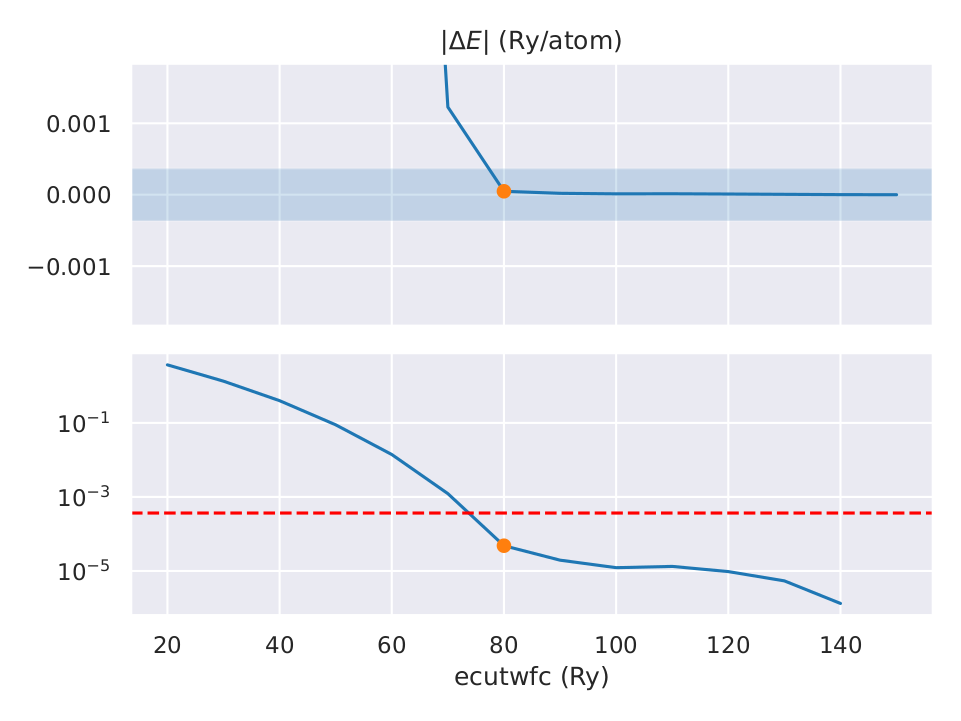
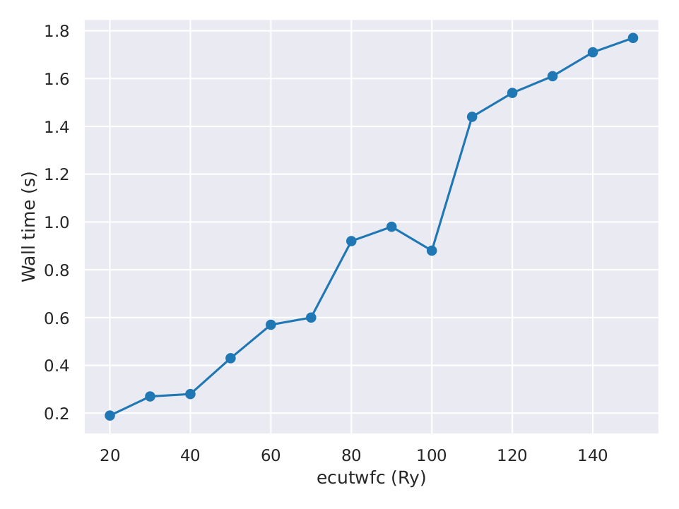
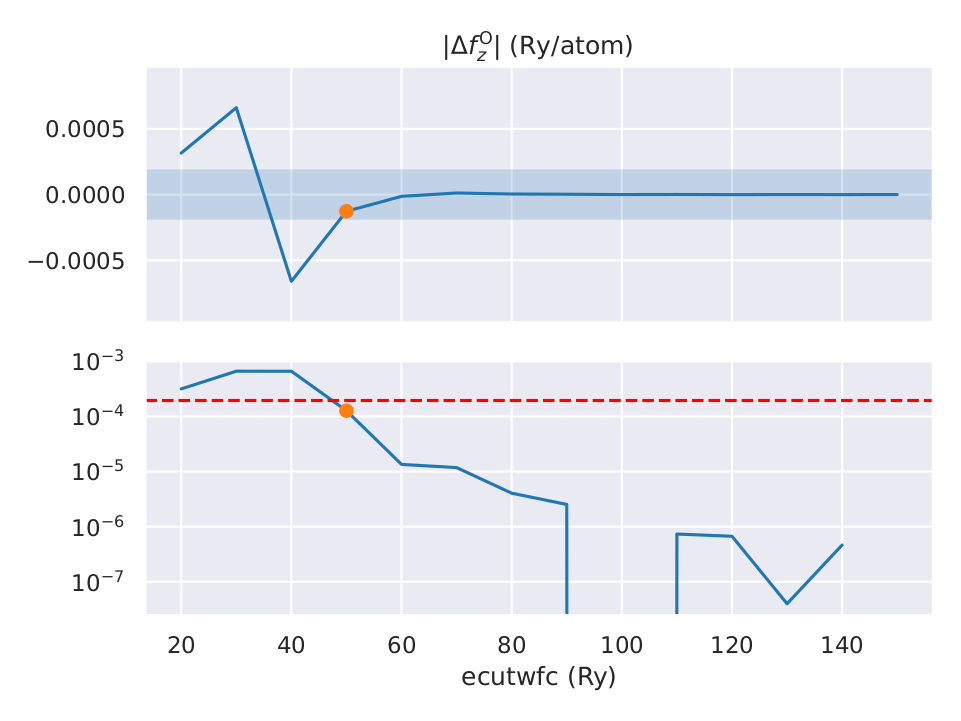
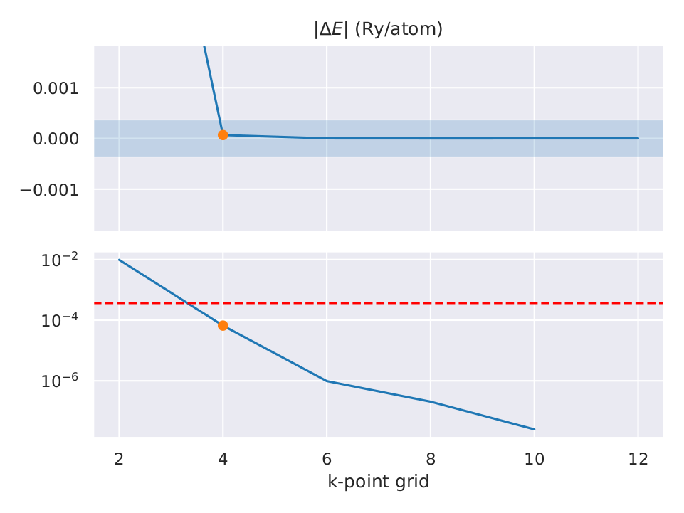
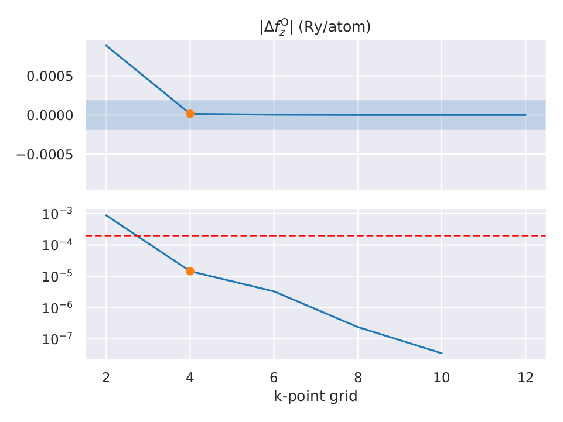
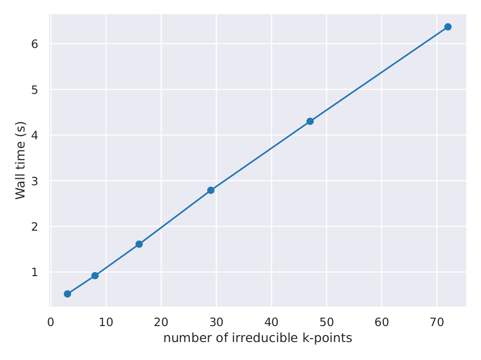
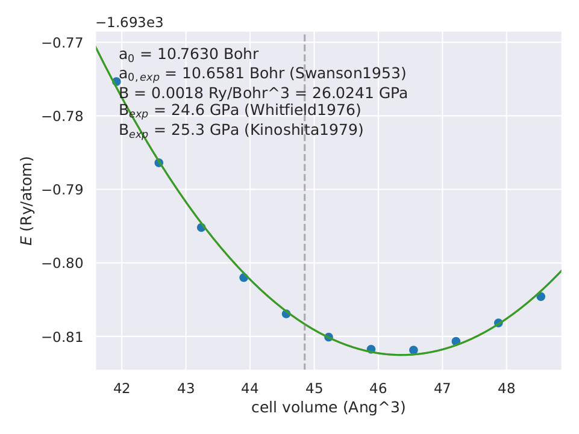
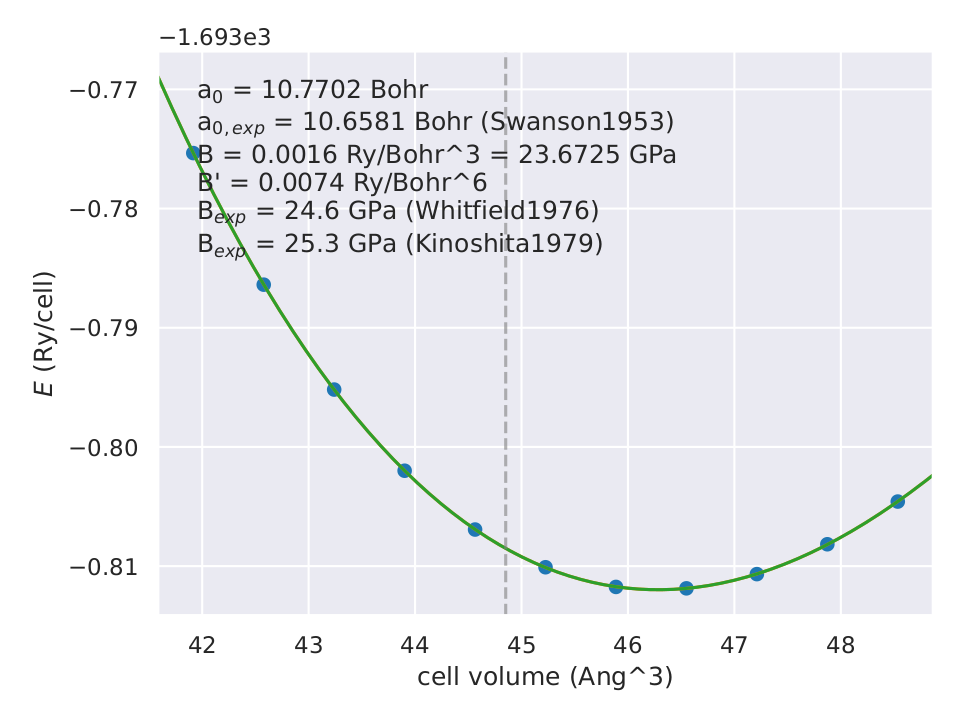
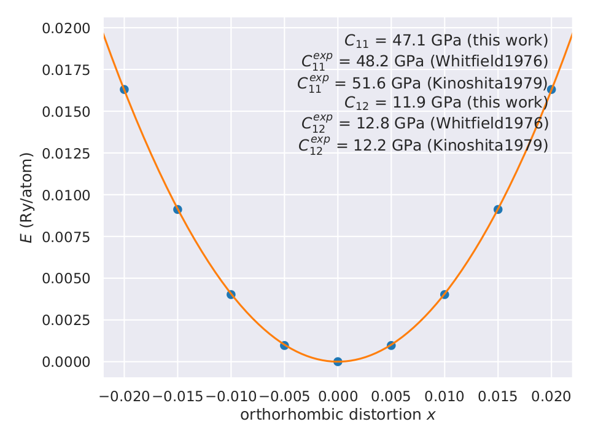
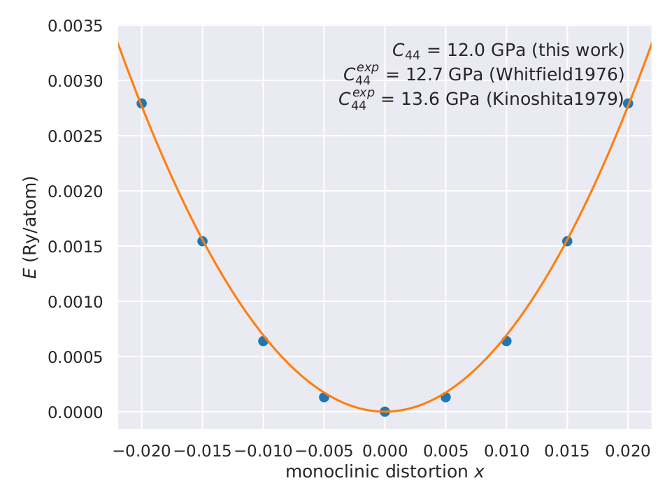

# Introduction to DFT: Hands-on session

**Tutors**: Edward Linscott & Pietro Delugas

This session continues from the [preliminary exercises](../before/preliminary-exercises/), where you ran your first `Quantum ESPRESSO` calculation on bulk NaCl. Here you will run convergence tests for the cutoff energy and _**k**_-point sampling, and then use the converged parameters to compute the equilibrium lattice parameter, bulk modulus, and elastic constants.

> **Note**
>
> In order to solve the convergence problems, you will have to run dozens of calculations. You will find this lab a lot easier if you (a) systematically organise your calculations in separate directories and (b) use a script to automatically run multiple calculations at once. We have provided an example `bash` script (`script.sh`) that you can use for this purpose. It would also be wise to write scripts to extract results from the output files and plot them. Wherever possible, avoid doing things by hand!

> **Note**
>
> While the calculations in the convergence problems should not take too much time, do not run more calculations than is necessary to obtain reliable results. This is good practice for real research, where calculations take much longer and computational resources are limited.

## Files provided

- `NaCl_primitive.scf.in` — input file for the NaCl primitive cell (use for Problems 1–6)
- `NaCl_conventional.scf.in` — input file for the NaCl conventional 8-atom cell (use for Problem 7)
- `pseudopotentials/` — pseudopotentials for Na and Cl
- `script.sh` — example bash script for running a sweep over a parameter

---

## Problem 1: Converging the total energy with respect to the cutoff energy

### Part A

We run convergence tests in order to make sure we control and understand the extent to which the numerical approximations we are making affect the final outputs of calculations. How do we rigorously define if an observable (*e.g.* the total energy) is converged with respect to a parameter (*e.g.* the energy cutoff) to within a given threshold (*e.g.* 5 meV/atom)?

<details>
<summary><b>Solution</b></summary>

An observable is converged with respect to a parameter once increasing that parameter further changes the observable by less than the chosen threshold. More precisely, the observable is converged at a parameter value $x$ if for *every* $x' > x$ the observable differs from its value at $x$ by less than the threshold. It is not enough for two *consecutive* values to agree — the observable must remain within the threshold for all larger values of the parameter.

</details>

### Part B

The table below shows the total energy of bulk NaCl as a function of the kinetic-energy cutoff `ecutwfc`, with all other input parameters kept fixed.

| `ecutwfc` (Ry) | Total energy (Ry) | Wall time (s) |
| ---: | ---: | ---: |
| 20  | -117.08776536 | 0.19 |
| 30  | -121.81051746 | 0.27 |
| 40  | -123.69556399 | 0.28 |
| 50  | -124.31482303 | 0.43 |
| 60  | -124.46440353 | 0.57 |
| 70  | -124.48993860 | 0.60 |
| 80  | -124.49229774 | 0.92 |
| 90  | -124.49235476 | 0.98 |
| 100 | -124.49236937 | 0.88 |
| 110 | -124.49236734 | 1.44 |
| 120 | -124.49237466 | 1.54 |
| 130 | -124.49238310 | 1.61 |
| 140 | -124.49239124 | 1.71 |
| 150 | -124.49239389 | 1.77 |

Plot the energy *vs.* cutoff energy data, and determine when the total energy is converged to within 5 meV/atom.

> **Note**
>
> `pw.x` reports the energy in units of Rydbergs per simulation cell.

<details>
<summary><b>Solution</b></summary>

Beyond `ecutwfc = 80 Ry` the total energy never changes by more than the threshold, so the energy is converged to within 5 meV/atom at **`ecutwfc ≈ 80 Ry`**.



</details>

### Part C

Do you see a trend in the energies with respect to the energy cutoff? If you see a trend, is this what you expect and why? If not, why? (Appeal to rigorous mathematical reasons where possible.)

<details>
<summary><b>Solution</b></summary>

The energy decreases monotonically with `ecutwfc`. This is expected: `ecutwfc` sets where the plane-wave (Fourier) expansion of the wavefunctions is truncated, so increasing it enlarges the variational basis. By the variational principle, a larger basis can only lower (or leave unchanged) the ground-state energy.

</details>

### Part D

Plot the wall time as a function of the kinetic energy cutoff. Can you explain the trend?

<details>
<summary><b>Solution</b></summary>

The wall time grows superlinearly with `ecutwfc`. The number of plane waves scales as $E_\text{cut}^{3/2}$, and the cost of the operations performed on them (diagonalisation, FFTs, ...) scales worse than linearly in the number of plane waves, so the overall scaling is superlinear. (The precise scaling will depend on specific implementation details.)



</details>

---

## Problem 2: Converging forces with respect to the cutoff energy [OPTIONAL]

We are usually interested in quantities other than energies. For this next problem, we will calculate the forces acting on atoms.

### Part A

In order to calculate forces, we first need to displace an atom from its equilibrium position. Why is this necessary? What would happen if you tried to converge the forces without displacing any atoms?

<details>
<summary><b>Solution</b></summary>

For this structure, the forces on all atoms vanish by symmetry. Without displacing an atom there is nothing meaningful to converge — the force would be zero regardless of the cutoff.

</details>

### Part B

Displace a Na (or Cl) atom by +0.05 in the *c* direction (fractional coordinates). Keeping the other parameters fixed, calculate the forces on a Na (or Cl) atom as a function of the kinetic energy cutoff. Converge the $z$-component of the force on one of the atoms to within 10 meV/Å. Provisionally, use the _**k**_-point mesh fixed to 4×4×4 including the Γ point.

> **Note**
>
> Forces are reported in the output file (in Ry/Bohr) after the total energies, *e.g.*
>
> ```text
> Forces acting on atoms (cartesian axes, Ry/au):
>
> atom    1 type  1   force =     0.00000000    0.00000000    0.02078255
> atom    2 type  2   force =    -0.00000000   -0.00000000   -0.02078255
> ```

<details>
<summary><b>Solution</b></summary>



</details>

### Part C

Do you see a trend in the forces with respect to the energy cutoff? If you see a trend, is this what you expect and why? If not, why?

<details>
<summary><b>Solution</b></summary>

Unlike total energies, forces are *not* guaranteed to converge monotonically with the cutoff. The variational principle bounds the total energy but says nothing about its derivatives, so the forces may oscillate before converging.

</details>

---

## Problem 3: Converging with respect to the _**k**_-point sampling

For this problem, continue to use the system with a displaced atom from Problem 2. This will allow you to use the same calculations for both the total energy and force convergence tests.

Use a converged value for the cutoff energy based on your results for Problems 1 and 2.

### Part A

Look at the _**k**_ points listed in an output file (look for `number of k points`). Is the number what you expect, based on the _**k**_-point grid specified in the corresponding input file? Why or why not?

> **Note**
>
> The number of irreducible _**k**_ points is reported in the `pw.x` output file.

<details>
<summary><b>Solution</b></summary>

The number of _**k**_ points reported in the output file is generally smaller than the number of points in the specified grid. `pw.x` uses the crystal symmetry to reduce the grid to the inequivalent points in the irreducible wedge of the Brillouin zone. (In unfortunate cases — for example, a shifted grid that is not compatible with the crystal symmetry — the reduced count can actually end up *larger* than for the corresponding unshifted grid.)

</details>

### Part B

Converge the total energy with respect to the _**k**_-point mesh size to within 5 meV/atom.

<details>
<summary><b>Solution</b></summary>



The total energy is converged to within 5 meV/atom with a **4×4×4** grid.

</details>

### Part C [OPTIONAL]

Converge the $z$-component of the force on one of the atoms with respect to the _**k**_-point mesh size to within 10 meV/Å.

<details>
<summary><b>Solution</b></summary>



The lower panel plots $|\Delta F_z|$ relative to the most accurate calculation; the dashed line marks the 10 meV/Å threshold.

</details>

### Part D [OPTIONAL]

Do you see a trend in your calculated energies and forces with respect to the size of the _**k**_-point mesh? If you see trends, are they what you expect and why? If not, why?

<details>
<summary><b>Solution</b></summary>

Neither the energies nor the forces are expected to converge monotonically with the mesh size. The _**k**_-point sum approximates an integral over the Brillouin zone, and this approximation can either over- or under-estimate the true integral — there is no variational principle here. And, as in Problem 2 Part C, derivatives such as forces carry no monotonicity guarantee either.

</details>

### Part E [OPTIONAL]

Plot how long the calculation takes as a function of the number of _**k**_ points. Can you explain the trend?

<details>
<summary><b>Solution</b></summary>

The wall time scales roughly linearly with the number of *irreducible* _**k**_ points, because the Kohn–Sham problem at each _**k**_ point is solved independently.



</details>

---

## Problem 4: Drawing conclusions from the convergence tests

### Part A

Mathematically, what is the relationship between atomic forces and total energies?

<details>
<summary><b>Solution</b></summary>

The force on atom $I$ is minus the gradient of the total energy with respect to that atom's position:

$$
\mathbf{F}_I = -\nabla_{\mathbf{R}_I} E.
$$

</details>

### Part B

Do total energies or forces tend to converge faster? Why?

<details>
<summary><b>Solution</b></summary>

In practice the forces — or, equivalently, energy *differences* — converge faster than absolute total energies. For small displacements the convergence errors at the displaced and undisplaced geometries are highly correlated, so they largely cancel when you take the difference.

</details>

### Part C

The pseudopotentials that you used in these calculations are norm-conserving pseudopotentials. How would your results change if we used ultrasoft pseudopotentials? Which other parameters would you run convergence tests for in this case?

<details>
<summary><b>Solution</b></summary>

With ultrasoft pseudopotentials the density cutoff `ecutrho` is no longer fixed at 4×`ecutwfc`; the two must be converged separately. The density cutoff would stay roughly the same (the density itself is essentially unchanged), but the required `ecutwfc` would be smaller, because ultrasoft pseudopotentials produce smoother wavefunctions that need fewer plane waves to represent accurately.

</details>

### Part D

Based on your convergence tests, state the values of `ecutwfc` and the _**k**_-point grid that you will use for all subsequent calculations to ensure the reliability of energies and forces.

<details>
<summary><b>Solution</b></summary>

`ecutwfc = 80 Ry` and _**k**_-point grid = `4 4 4`

Note: don't be conservative and pick larger values. This defeats the purpose of convergence testing, which is to avoid unnecessary computational expense.

</details>

---

## Problem 5: The equilibrium lattice parameter

Determine the equilibrium lattice parameter of NaCl by calculating its energy-versus-volume profile.

> **Note**
>
> For this problem, you can adjust the `bash` script so that it modifies the lattice constant `celldm(1)`.

> **Note**
>
> Later, in Problem 8, you will be asked to compare your computed lattice parameter against experimental values, but it is already a good idea to look up the experimental value so that you can make sure your calculations are not completely off.

<details>
<summary><b>Solution</b></summary>

Compute the total energy as a function of cell volume (or lattice parameter), plot it, and fit it to locate the minimum. The minimum gives the equilibrium lattice parameter. A (rough) parabolic fit gives $a_0 \approx 10.76$ Bohr.



</details>

---

## Problem 6: The bulk modulus

The bulk modulus is a measure of the stiffness of a material. It is defined as

$$ B = - V_0 \left.\frac{\partial P}{\partial V}\right|_{V=V_0}, $$

where *P* is the pressure on the material, *V* is its volume, and *V*₀ is its equilibrium volume.

The bulk modulus is a key property of materials, and can help us identify different phases of matter and the phase transitions between them.

### Part A

Using the fact that pressure can be written as a derivative of energy with respect to volume, derive a second-order formula for the bulk modulus in terms of volumes and total energies.

<details>
<summary><b>Solution</b></summary>

Pressure is $P = -\partial E/\partial V$, so

$$ B = -V_0 \left.\frac{\partial P}{\partial V}\right|_{V_0} = V_0 \left.\frac{\partial^2 E}{\partial V^2}\right|_{V_0}. $$

</details>

### Part B

To calculate the bulk modulus, we need to compute the total energy as a function of cell volume. It is important to choose an appropriate window of volumes across which to compute the total energy. What will happen if you try to compute the bulk modulus across a window of volumes that is too wide? What about if the window is too narrow?

<details>
<summary><b>Solution</b></summary>

If the window is too wide, higher-order (anharmonic) terms become significant, the second-order approximation breaks down, and the fit — and hence $B$ — is poor. If the window is too narrow, the energy differences between data points become tiny and comparable to numerical noise, again giving an unreliable $B$.

</details>

### Part C

Calculate the bulk modulus *B* of NaCl using the second-order equation you derived above. Depending on your answer to Part B, you can re-use some or all of your data from Problem 5.

> **Note**
>
> This is the simplest possible approach to computing the bulk modulus: approximate the energy-versus-volume relationship to second order. Remember that `pw.x` calculates energies per unit cell.

<details>
<summary><b>Solution</b></summary>

Applying the second-order formula to the $E(V)$ data gives a bulk modulus of $B \approx 26$ GPa for NaCl. The exact value is sensitive to the fitting window and the nature of the fit.


</details>

### Part D [OPTIONAL]

Calculate the bulk modulus *B* of NaCl using the third-order Birch–Murnaghan isothermal equation of state.

> **Note**
>
> A more complicated approach than the second-order one is to use an *equation of state* — that is, a function that describes the relationship of state variables. There are several competing proposals for the precise shape of this function. Here we use the *third-order Birch–Murnaghan isothermal equation of state*:
>
> $$ P(V) = \frac{3 B_0}{2} \left[ \left(\frac{V_0}{V}\right)^{7/3} - \left(\frac{V_0}{V}\right)^{5/3} \right] \left\lbrace 1 + \frac{3}{4} (B_0' - 4) \left[ \left(\frac{V_0}{V}\right)^{2/3} - 1 \right] \right\rbrace, $$
>
> where *P* is the pressure, *V*₀ is the equilibrium volume, *V* is the deformed volume, *B*₀ is the bulk modulus, and *B*₀′ is the derivative of the bulk modulus with respect to pressure. Integration of this pressure expression with volume gives the energy-versus-volume relationship
>
> $$ E(V) = E_0 + \frac{9 V_0 B_0}{16} \left\lbrace \left[ \left(\frac{V_0}{V}\right)^{2/3} - 1 \right]^3 B_0' + \left[ \left(\frac{V_0}{V}\right)^{2/3} - 1 \right]^2 \left[ 6 - 4 \left(\frac{V_0}{V}\right)^{2/3} \right] \right\rbrace. $$
>
> To perform this fitting you can either implement it yourself (*e.g.* using `python`)
> 
> ```python
>
> from scipy.optimize import curve_fit
>
> def birch_murnaghan(x, e0, v0, b0, db0):
>     x23 = (v0/x)**(2/3)
>     return e0 + 9*v0*b0/16*(db0*(x23 - 1)**3 + (x23 - 1)**2 * (6 - 4 * x23))
>
> volumes = [...]
> energies = [...]
>
> curve_fit(birch_murnaghan, volumes, energies)
> ```
> 
> or use the interactive `ev.x` program provided with `Quantum ESPRESSO`. This program works interactively: it expects that you specify units (`Ang` or `ANG` or `ang` indicates Ångströms, while any other input will default to atomic units), the type of Bravais lattice that you used, the type of equation of state that you want to use for the fit (in our case, `birch1`), and an input file. In the input file for `ev.x` you have to provide two columns for the case of an FCC lattice: the first one contains the lattice parameter and the second one the total energy obtained.

>

<details>
<summary><b>Solution</b></summary>

Fitting the $E(V)$ data to the third-order Birch–Murnaghan equation of state gives $B \approx 24$ GPa.



</details>

### Part E [OPTIONAL]

Compare your computed bulk modulus obtained with the two methods described above. Which do you expect to be more accurate? Why?

<details>
<summary><b>Solution</b></summary>

The Birch–Murnaghan value is expected to be more reliable. The parabolic fit is thrown off by anharmonicity, whereas the Birch–Murnaghan equation of state accounts for it — this matters especially if the parabolic fit is poor.

</details>

## Problem 7: Elastic constants

Elastic constants describe how a material responds to deformation (think of them as a generalisation of the spring constant *k*). Hooke's law $\mathbf{F} = -k\,\mathbf{x}$ generalises to continuous media as

$$ \sigma_{ij} = \sum_{kl} C_{ijkl}\, \epsilon_{kl}, $$

where $\sigma_{ij}$ is the stress tensor, $\epsilon_{kl} = \Delta L / L$ is the strain tensor, and $C_{ijkl}$ is the **stiffness tensor** — an intrinsic property of the material. This is a linear approximation, valid only for small strains.

The stiffness tensor has 81 components, but symmetries of $\sigma$ and $\epsilon$ reduce this to 36, and the symmetry $C_{ij} = C_{ji}$ further reduces it to 21 independent components. Using **Voigt notation** (1=*xx*, 2=*yy*, 3=*zz*, 4=*yz*, 5=*zx*, 6=*xy*) we can write Hooke's law as a 6×6 matrix equation,

$$ \begin{pmatrix} \sigma_1 \cr \sigma_2 \cr \sigma_3 \cr \sigma_4 \cr \sigma_5 \cr \sigma_6 \end{pmatrix} = \begin{pmatrix} C_{11} & C_{12} & C_{13} & C_{14} & C_{15} & C_{16} \cr C_{12} & C_{22} & C_{23} & C_{24} & C_{25} & C_{26} \cr C_{13} & C_{23} & C_{33} & C_{34} & C_{35} & C_{36} \cr C_{14} & C_{24} & C_{34} & C_{44} & C_{45} & C_{46} \cr C_{15} & C_{25} & C_{35} & C_{45} & C_{55} & C_{56} \cr C_{16} & C_{26} & C_{36} & C_{46} & C_{56} & C_{66} \end{pmatrix} \begin{pmatrix} \epsilon_1 \cr \epsilon_2 \cr \epsilon_3 \cr \epsilon_4 \cr \epsilon_5 \cr \epsilon_6 \end{pmatrix}. $$

**Cubic symmetry** (as in NaCl) reduces the independent components to just three — *C*₁₁, *C*₁₂, and *C*₄₄ — and the stiffness matrix takes the form

$$ \mathbf{C} = \begin{pmatrix} C_{11} & C_{12} & C_{12} & 0 & 0 & 0 \cr C_{12} & C_{11} & C_{12} & 0 & 0 & 0 \cr C_{12} & C_{12} & C_{11} & 0 & 0 & 0 \cr 0 & 0 & 0 & C_{44} & 0 & 0 \cr 0 & 0 & 0 & 0 & C_{44} & 0 \cr 0 & 0 & 0 & 0 & 0 & C_{44} \end{pmatrix}. $$

Strain is applied to the lattice vectors by

$$ \begin{pmatrix} \mathbf{a}'_1 \cr \mathbf{a}'_2 \cr \mathbf{a}'_3 \end{pmatrix} = \begin{pmatrix} \mathbf{a}_1 \cr \mathbf{a}_2 \cr \mathbf{a}_3 \end{pmatrix} (I + \varepsilon), \qquad \varepsilon = \begin{pmatrix} e_1 & e_6/2 & e_5/2 \cr e_6/2 & e_2 & e_4/2 \cr e_5/2 & e_4/2 & e_3 \end{pmatrix}. $$

To second order, the total energy of the distorted lattice is

$$ E \approx E_0 - P(V_0)\, \Delta V + \tfrac{1}{2} V_0 \sum_{i=1}^{6} \sum_{j=1}^{6} C_{ij}\, e_i e_j. $$

In this lab we will choose volume-conserving strains ($\Delta V = 0$), so the linear-in-strain term vanishes and the energy isolates particular $C_{ij}$ depending on the strain pattern.

> **Note**
>
> The calculations for this problem will be more expensive than those you have run thus far, but should still be manageable on a laptop.

### Part A

For this exercise, we will use the conventional unit cell containing 8 atoms. In general, what are the advantages and disadvantages of using a conventional cell with orthogonal lattice vectors rather than the primitive cell?

<details>
<summary><b>Solution</b></summary>

**Advantages of the primitive cell:**

- It is computationally much cheaper: at each _**k**_ point the eigenproblem has size proportional to the number of basis functions per cell, so the $\mathcal{O}(N^3)$ cost grows rapidly with cell size.
- The primitive cell exposes *more* translational symmetries than the conventional cell. The extra translations $\{I | \boldsymbol{\tau}\}$ — where $\boldsymbol{\tau}$ is a primitive lattice vector that is *not* a conventional lattice vector (*e.g.* $\boldsymbol{\tau} = \tfrac{a}{2}(\hat{x}+\hat{y})$ for fcc) — commute with the Hamiltonian and block-diagonalise it. In the primitive cell these blocks live at distinct _**k**_ points in a larger Brillouin zone; in the conventional cell those primitive _**k**_ points fold onto a single conventional _**k**_ and are solved together as one larger eigenproblem.

**Advantages of the conventional cell:**

- Fewer conventions are required — you can define some pretty weird primitive cells!
- The point-group symmetries of the crystal (*e.g.* the four-fold rotations about $x$, $y$, $z$ in rocksalt) act manifestly on orthogonal Cartesian axes, so setting up strain patterns, supercells, surfaces, *etc.* is more transparent. (The primitive cell describes *the same* crystal and possesses the same point group; the rotations simply permute the non-orthogonal primitive vectors rather than acting along single Cartesian directions.)
- The smaller Brillouin zone means a coarser _**k**_-grid achieves the same sampling density. This is not a free lunch, however: it is the flip side of the folding above — the saving on _**k**_ points is more than offset by the larger eigenproblem at each _**k**_ point.

</details>

### Part B

Compute the elastic constants *C*₁₁ and *C*₁₂ using the volume-conserving **orthorhombic strain**

$$ \varepsilon = \begin{pmatrix} x & 0 & 0 \cr 0 & -x & 0 \cr 0 & 0 & \dfrac{x^2}{1 - x^2} \end{pmatrix}. $$

For different values of $x$, compute the strained lattice vectors $\mathbf{a}'_i$, run a calculation, and obtain the energy profile $E(x)$. By symmetry,

$$ \Delta E(x) = \Delta E(-x) = V_0 (C_{11} - C_{12})\, x^2. $$

Combine this with $B = \tfrac{1}{3}(C_{11} + 2 C_{12})$ — using the Birch–Murnaghan value of $B$ from Problem 6 — to extract $C_{11}$ and $C_{12}$.

The strained cell is orthorhombic, so use the 8-atom orthorhombic unit cell (`ibrav=8`):

```text
celldm(1) = |a'1|
celldm(2) = |a'2| / |a'1|
celldm(3) = |a'3| / |a'1|
```

Applying the strain $\varepsilon$ to the cubic lattice vectors gives $|a'_1| = a(1+x)$, where `a` is the optimized lattice parameter from Problems 5 and 6. In your script you can therefore compute this `celldm` value for a given strain `x` with:

```bash
celldm1=$(echo "$a * (1 + $x)" | bc -l)
```

and the remaining `celldm` values follow analogously.

> **Note**
>
> Make sure that you use the optimized cell parameter you determined in Problems 5 and 6! This is important because the equations we use to calculate the elastic constants assume that we are applying strain to the equilibrium structure. If you use the incorrect cell parameter, there will be a mismatch between the energies you calculate and the equations you use to extract the elastic constants.

> **Note**
>
> A list of all possible values of `ibrav` can be found in the [`Quantum ESPRESSO` documentation](https://www.quantum-espresso.org/Doc/INPUT_PW.html#idm199). You will need to work out the appropriate atomic positions for the 8-atom conventional cell yourself. When entering the `celldm` ratios, enter the numerical result of the division, not the expression itself.

> **Note**
>
> Upon the application of strain, it may happen that not all atomic positions in the cell are fixed by symmetry, as there is more than one basis element (*i.e.* a Na and a Cl atom). When we apply the strain, one of these atoms could move to a different relative position and lower the total energy of the cell. This means that when we calculate the elastic constant we should allow the cell to relax the atoms to their equilibrium positions instead of fixing them. This is done by changing the `calculation` variable in the `control` namelist from `scf` to `relax`:
>
> ```text
> calculation="relax"
> ```

<details>
<summary><b>Solution</b></summary>

For each strain $x$, build the strained lattice vectors, run a `relax` calculation, and plot $\Delta E(x)$. Fitting $\Delta E = V_0 (C_{11} - C_{12})\, x^2$ gives $C_{11} - C_{12}$; combining this with $B = \tfrac{1}{3}(C_{11} + 2 C_{12})$ from Problem 6 then yields $C_{11} \approx 47$ GPa and $C_{12} \approx 12$ GPa, close to the experimental values.



</details>

### Part C [OPTIONAL]

Compute *C*₄₄ using the volume-conserving **monoclinic shear strain**

$$ \varepsilon = \begin{pmatrix} 0 & x/2 & 0 \cr x/2 & 0 & 0 \cr 0 & 0 & \dfrac{x^2}{4 - x^2} \end{pmatrix}, $$

which gives

$$ \Delta E(x) = \Delta E(-x) = \tfrac{1}{2} V_0\, C_{44}\, x^2. $$

Model this with the 8-atom monoclinic unit cell (`ibrav=12`):

```text
celldm(1) = |a'1|
celldm(2) = |a'2| / |a'1|
celldm(3) = |a'3| / |a'1|
celldm(4) = (a'1 · a'2) / (|a'1| |a'2|)
```

<details>
<summary><b>Solution</b></summary>

Likewise, plot $\Delta E(x)$ for the monoclinic shear strain and fit $\Delta E = \tfrac{1}{2} V_0 C_{44}\, x^2$ to extract $C_{44} \approx 12$ GPa, close to the experimental value.



</details>

### Part D

How much longer did the individual calculations on a conventional cell take compared to earlier primitive cell calculations? Can you explain this?

<details>
<summary><b>Solution</b></summary>

The conventional cell has 4× as many atoms as the primitive cell (8 vs 2). Since the cost of DFT scales as $\mathcal{O}(N^3)$ in the number of electrons, each calculation is expected to be roughly $4^3 = 64\times$ more expensive *per _**k**_ point*. This could be partially offset if we used a smaller _**k**_-point grid (because the conventional cell has a smaller Brillouin zone and therefore needs fewer _**k**_ points for the same sampling density).

</details>

### Part E

In principle, you could have performed these calculations with a coarser _**k**_-point grid than the one you selected during the convergence tests (without compromising on accuracy). Why?

<details>
<summary><b>Solution</b></summary>

The conventional cell is larger in real space, so its Brillouin zone is smaller. A coarser _**k**_-point grid then samples reciprocal space at the same density as the finer grid used for the primitive cell.

</details>

---

## Problem 8: Final take-aways

### Part A

In our convergence tests we ensured that total energies and forces were converged to within some particular thresholds. In retrospect, when trying to accurately compute lattice parameters, bulk moduli, and elastic constants, was it more important to ensure the accuracy of total energies or forces? (Or would it have been better to converge some other quantity entirely?) Why?

<details>
<summary><b>Solution</b></summary>

Forces (derivatives of the total energy) are a better — though still imperfect — proxy for lattice parameters, bulk moduli, and elastic constants than total energies, because all of these quantities depend on energy *derivatives*. The most direct choice would be to converge stresses, as this is the relevant second-order derivative. One might be tempted to converge the target properties themselves, but in practice that is inefficient: the point of convergence testing is to use cheap proxies and so avoid expensive calculations.

</details>

### Part B

Compare your computed lattice parameter, bulk modulus (calculated using both the second-order approximation and the Birch–Murnaghan equation of state), and elastic constants against experimental values. Find multiple sources and cite them appropriately. Be as quantitative as possible (*e.g.* report percentage errors).

<details>
<summary><b>Solution</b></summary>

| Property | This work (DFT) | Experiment |
| --- | --- | --- |
| Lattice constant (Å) | 5.69 | 5.64<sup>[1](#swanson1953)</sup> |
| Bulk modulus $B$ (GPa) | 26 (parabolic); 24 (Birch–Murnaghan) | 24.6<sup>[2](#whitfield1976)</sup>; 25.3<sup>[3](#kinoshita1979)</sup> |
| $C_{11}$ (GPa) | 47 | 48.2<sup>[2](#whitfield1976)</sup>; 51.6<sup>[3](#kinoshita1979)</sup> |
| $C_{12}$ (GPa) | 12 | 12.8<sup>[2](#whitfield1976)</sup>; 12.2<sup>[3](#kinoshita1979)</sup> |
| $C_{44}$ (GPa) | 12 | 12.7<sup>[2](#whitfield1976)</sup>; 13.6<sup>[3](#kinoshita1979)</sup> |

For the bulk modulus, the Birch–Murnaghan value should agree with experiment better than the parabolic fit, especially if the parabolic fit is shaky.

</details>

### Part C

Do we expect semi-local DFT to be able to predict these properties with high accuracy? Why/why not?

<details>
<summary><b>Solution</b></summary>

These are all ground-state properties, for which DFT is generally reliable. For example, across a wide range of materials the PBE functional gives a mean absolute relative error of about 4% in cell volumes<sup>[4](#isaacs2018)</sup> — corresponding to roughly 1% in lattice parameters — so we expect semi-local DFT to perform reasonably well here.

</details>

---

## References

1. <a id="swanson1953"></a>H. E. Swanson and R. K. Fuyat, *Standard X-ray Diffraction Powder Patterns*, Circular of the Bureau of Standards no. 539, Volume 2, National Bureau of Standards (1953). [archive.org](http://archive.org/details/circularofbureau5392swan)
2. <a id="whitfield1976"></a>C. H. Whitfield, E. M. Brody, and W. A. Bassett, "Elastic moduli of NaCl by Brillouin scattering at high pressure in a diamond anvil cell", *Review of Scientific Instruments* **47**(8), 942–947 (1976). [doi:10.1063/1.1134778](https://doi.org/10.1063/1.1134778)
3. <a id="kinoshita1979"></a>H. Kinoshita, N. Hamaya, and H. Fujisawa, "Elastic properties of single-crystal NaCl under high pressures to 80 kbar", *Journal of Physics of the Earth* **27**, 337–350 (1979).
4. <a id="isaacs2018"></a>E. B. Isaacs and C. Wolverton, "Performance of the strongly constrained and appropriately normed density functional for solid-state materials", *Physical Review Materials* **2**, 063801 (2018). [doi:10.1103/PhysRevMaterials.2.063801](https://doi.org/10.1103/PhysRevMaterials.2.063801)

---

# TODO
- [ ] band structures
- [ ] stresses from input files