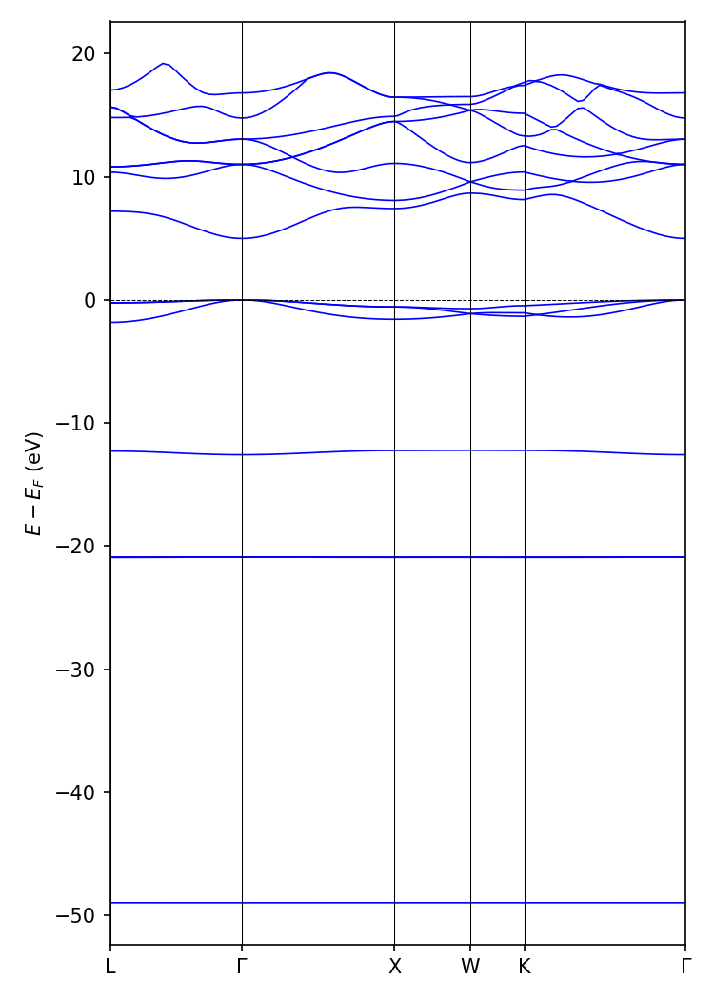
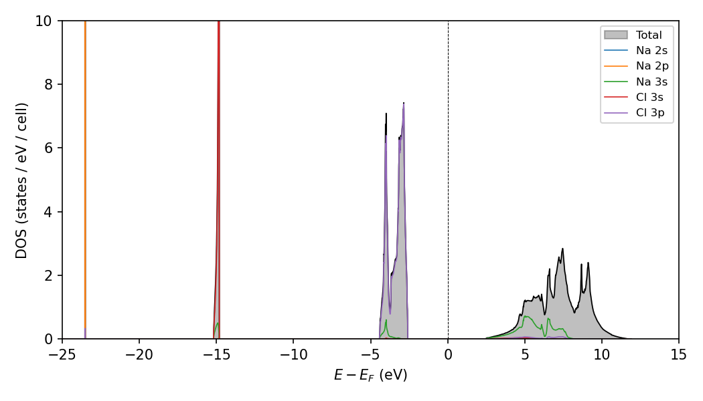
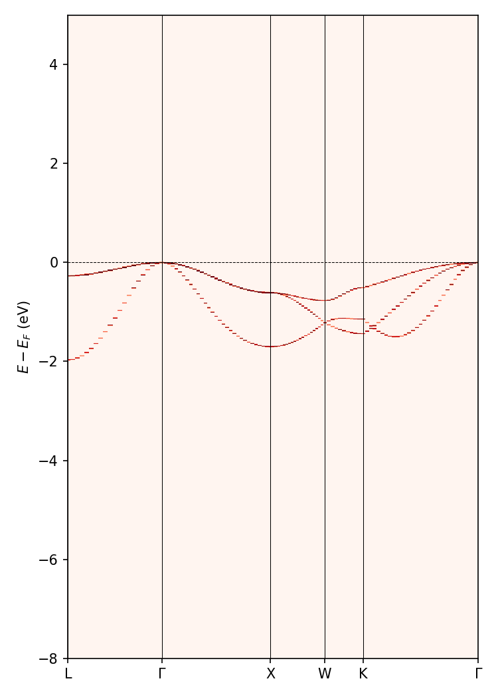

# Introduction to DFT: Hands-on session

**Tutors**: Edward Linscott & Pietro Delugas

This session continues from the [preliminary exercise](../before/preliminary-exercise/), where you ran your first `Quantum ESPRESSO` calculation on bulk NaCl. Here you will run convergence tests for the cutoff energy and _**k**_-point sampling, and then use the converged parameters to compute the equilibrium lattice parameter, bulk modulus, and elastic constants.

> [!NOTE]
>
> In order to solve the convergence problems, you will have to run dozens of calculations. You will find this lab a lot easier if you (a) systematically organise your calculations in separate directories and (b) use a script to automatically run multiple calculations at once. We have provided an example `bash` script (`script.sh`) that you can use for this purpose. It would also be wise to write scripts to extract results from the output files and plot them. Wherever possible, avoid doing things by hand!

> [!NOTE]
>
> While the calculations in the convergence problems should not take too much time, do not run more calculations than is necessary to obtain reliable results. This is good practice for real research, where calculations take much longer and computational resources are limited.

## Files provided

- `NaCl_primitive.scf.in` — input file for the NaCl primitive cell (use for Problems 1–6)
- `NaCl_conventional.scf.in` — input file for the NaCl conventional 8-atom cell (use for Problem 7)
- `pseudopotentials/` — pseudopotentials for Na and Cl
- `script.sh` — example bash script for running a sweep over a parameter

---

## Problem 1: Converging the total energy with respect to the cutoff energy

### Part A

We run convergence tests in order to make sure we control and understand the extent to which the numerical approximations we are making affect the final outputs of calculations. How do we rigorously define if an observable (*e.g.* the total energy) is converged with respect to a parameter (*e.g.* the energy cutoff) to within a given threshold (*e.g.* 5 meV/atom)?

<details>
<summary><b>Solution</b></summary>

An observable is converged with respect to a parameter once increasing that parameter further changes the observable by less than the chosen threshold. More precisely, the observable is converged at a parameter value $x$ if for *every* $x' ≥ x$ the observable differs from its value in the infinite limit by less than the threshold. It is not enough for two *consecutive* values to agree — the observable must remain within the threshold for all larger values of the parameter.

</details>

### Part B

The table below shows the total energy of bulk NaCl as a function of the kinetic-energy cutoff `ecutwfc`, with all other input parameters kept fixed.

| `ecutwfc` (Ry) | Total energy (Ry) | Wall time (s) |
| ---: | ---: | ---: |
| 20  | -117.08776536 | 0.19 |
| 30  | -121.81051746 | 0.27 |
| 40  | -123.69556399 | 0.28 |
| 50  | -124.31482303 | 0.43 |
| 60  | -124.46440353 | 0.57 |
| 70  | -124.48993860 | 0.60 |
| 80  | -124.49229774 | 0.92 |
| 90  | -124.49235476 | 0.98 |
| 100 | -124.49236937 | 0.88 |
| 110 | -124.49236734 | 1.44 |
| 120 | -124.49237466 | 1.54 |
| 130 | -124.49238310 | 1.61 |
| 140 | -124.49239124 | 1.71 |
| 150 | -124.49239389 | 1.77 |

Plot the energy *vs.* cutoff energy data, and determine when the total energy is converged to within 5 meV/atom.

> [!TIP]
>
> `pw.x` reports the energy in units of Rydbergs per simulation cell.

> [!NOTE]
> The `qe` environment comes with an alpha release of the new [`qe-tools` package](https://qe-tools.readthedocs.io/en/latest/), which can help with parsing Quantum ESPRESSO outputs.
> For example:
>
> ```python
> from qe_tools.outputs import PwOutput
>
> pw_out = PwOutput.from_files(stdout='out/NaCl.ecut=20.out')
> pw_out.outputs.total_energy
> ```
>
> `qe-tools` returns total energies in Ry by default. To get a unit-aware [`pint`](https://pint.readthedocs.io/en/stable/) quantity that you can convert into any unit:
>
> ```python
> total_energy = pw_out.get_output('total_energy', to='pint')
> total_energy.to('eV')
> ```
>
> See the [`qe-tools.ipynb`](qe-tools.ipynb) notebook for some more examples, or the [`qe-tools` documentation](https://qe-tools.readthedocs.io/en/latest/getting_started/).

<details>
<summary><b>Solution</b></summary>

Beyond `ecutwfc = 80 Ry` the total energy never changes by more than the threshold, so the energy is converged to within 5 meV/atom at **`ecutwfc ≈ 80 Ry`**.


</details>

### Part C

Do you see a trend in the energies with respect to the energy cutoff? If you see a trend, is this what you expect and why? If not, why? (Appeal to rigorous mathematical reasons where possible.)

<details>
<summary><b>Solution</b></summary>

The energy decreases monotonically with `ecutwfc`. This is expected: `ecutwfc` sets where the plane-wave (Fourier) expansion of the wavefunctions is truncated, so increasing it enlarges the variational basis. By the variational principle, a larger basis can only lower (or leave unchanged) the ground-state energy.

</details>

### Part D

Plot the wall time as a function of the kinetic energy cutoff. Can you explain the trend?

<details>
<summary><b>Solution</b></summary>

The wall time grows superlinearly with `ecutwfc`. The number of plane waves scales as $E_\text{cut}^{3/2}$, and the cost of the operations performed on them (diagonalisation, FFTs, ...) scales worse than linearly in the number of plane waves, so the overall scaling is superlinear. (The precise scaling will depend on specific implementation details.)


</details>

---

## Problem 2: Converging forces with respect to the cutoff energy [OPTIONAL]

We are usually interested in quantities other than energies. For this next problem, we will calculate the forces acting on atoms.

### Part A

In order to calculate forces, we first need to displace an atom from its equilibrium position. Why is this necessary? What would happen if you tried to converge the forces without displacing any atoms?

<details>
<summary><b>Solution</b></summary>

For this structure, the forces on all atoms vanish by symmetry. Without displacing an atom there is nothing meaningful to converge — the force would be zero regardless of the cutoff.

</details>

### Part B

Displace a Na (or Cl) atom by +0.05 in the *c* direction (fractional coordinates). Keeping the other parameters fixed, calculate the forces on a Na (or Cl) atom as a function of the kinetic energy cutoff. Converge the $z$-component of the force on one of the atoms to within 10 meV/Å. Provisionally, use the _**k**_-point mesh fixed to 4×4×4 including the Γ point.

> [!NOTE]
>
> Forces are reported in the output file (in Ry/Bohr) after the total energies, *e.g.*
>
> ```text
> Forces acting on atoms (cartesian axes, Ry/au):
>
> atom    1 type  1   force =     0.00000000    0.00000000    0.02078255
> atom    2 type  2   force =    -0.00000000   -0.00000000   -0.02078255
> ```

<details>
<summary><b>Solution</b></summary>


</details>

### Part C

Do you see a trend in the forces with respect to the energy cutoff? If you see a trend, is this what you expect and why? If not, why?

<details>
<summary><b>Solution</b></summary>

Unlike total energies, forces are *not* guaranteed to converge monotonically with the cutoff. The variational principle bounds the total energy but says nothing about its derivatives, so the forces may oscillate before converging.

</details>

---

## Problem 3: Converging with respect to the _**k**_-point sampling

For this problem, continue to use the system with a displaced atom from Problem 2. This will allow you to use the same calculations for both the total energy and force convergence tests.

Use a converged value for the cutoff energy based on your results for Problems 1 and 2.

### Part A

Look at the _**k**_ points listed in an output file (look for `number of k points`). Is the number what you expect, based on the _**k**_-point grid specified in the corresponding input file? Why or why not?

> [!NOTE]
>
> The number of irreducible _**k**_ points is reported in the `pw.x` output file.

<details>
<summary><b>Solution</b></summary>

The number of _**k**_ points reported in the output file is generally smaller than the number of points in the specified grid. `pw.x` uses the crystal symmetry to reduce the grid to the inequivalent points in the irreducible wedge of the Brillouin zone. (In unfortunate cases — for example, a shifted grid that is not compatible with the crystal symmetry — the reduced count can actually end up *larger* than for the corresponding unshifted grid.)

</details>

### Part B

Converge the total energy with respect to the _**k**_-point mesh size to within 5 meV/atom.

<details>
<summary><b>Solution</b></summary>


The total energy is converged to within 5 meV/atom with a **4×4×4** grid.

</details>

### Part C [OPTIONAL]

Converge the $z$-component of the force on one of the atoms with respect to the _**k**_-point mesh size to within 10 meV/Å.

<details>
<summary><b>Solution</b></summary>


The lower panel plots $|\Delta F_z|$ relative to the most accurate calculation; the dashed line marks the 10 meV/Å threshold.

</details>

### Part D [OPTIONAL]

Do you see a trend in your calculated energies and forces with respect to the size of the _**k**_-point mesh? If you see trends, are they what you expect and why? If not, why?

<details>
<summary><b>Solution</b></summary>

Neither the energies nor the forces are expected to converge monotonically with the mesh size. The _**k**_-point sum approximates an integral over the Brillouin zone, and this approximation can either over- or under-estimate the true integral — there is no variational principle here. And, as in Problem 2 Part C, derivatives such as forces carry no monotonicity guarantee either.

</details>

### Part E [OPTIONAL]

Plot how long the calculation takes as a function of the number of _**k**_ points. Can you explain the trend?

<details>
<summary><b>Solution</b></summary>

The wall time scales roughly linearly with the number of *irreducible* _**k**_ points, because the Kohn–Sham problem at each _**k**_ point is solved independently.


</details>

---

## Problem 4: Drawing conclusions from the convergence tests

### Part A

Mathematically, what is the relationship between atomic forces and total energies?

<details>
<summary><b>Solution</b></summary>

The force on atom $`I`$ is minus the gradient of the total energy with respect to that atom's position:

$`
\mathbf{F}_I = -\nabla_{\mathbf{R}_I} E.
`$

</details>

### Part B

Do total energies or forces tend to converge faster? Why?

<details>
<summary><b>Solution</b></summary>

In practice the forces — or, equivalently, energy *differences* — converge faster than absolute total energies. For small displacements the convergence errors at the displaced and undisplaced geometries are highly correlated, so they largely cancel when you take the difference.

</details>

### Part C

The pseudopotentials that you used in these calculations are norm-conserving pseudopotentials. How would your results change if we used ultrasoft pseudopotentials? Which other parameters would you run convergence tests for in this case?

<details>
<summary><b>Solution</b></summary>

With ultrasoft pseudopotentials the density cutoff `ecutrho` is no longer fixed at 4×`ecutwfc`; the two must be converged separately. The density cutoff would stay roughly the same (the density itself is essentially unchanged), but the required `ecutwfc` would be smaller, because ultrasoft pseudopotentials produce smoother wavefunctions that need fewer plane waves to represent accurately.

</details>

### Part D

Based on your convergence tests, state the values of `ecutwfc` and the _**k**_-point grid that you will use for all subsequent calculations to ensure the reliability of energies and forces.

<details>
<summary><b>Solution</b></summary>

`ecutwfc = 80 Ry` and _**k**_-point grid = `4 4 4`

Note: don't be conservative and pick larger values. This defeats the purpose of convergence testing, which is to avoid unnecessary computational expense.

</details>

---

## Problem 5: The equilibrium lattice parameter

Determine the equilibrium lattice parameter of NaCl by calculating its energy-versus-volume profile.

> [!NOTE]
>
> For this problem, you can adjust the `bash` script so that it modifies the lattice constant `celldm(1)`.

> [!NOTE]
>
> Later, in Problem 8, you will be asked to compare your computed lattice parameter against experimental values, but it is already a good idea to look up the experimental value so that you can make sure your calculations are not completely off.

<details>
<summary><b>Solution</b></summary>

Compute the total energy as a function of cell volume (or lattice parameter), plot it, and fit it to locate the minimum. The minimum gives the equilibrium lattice parameter. A (rough) parabolic fit gives $a_0 \approx 10.76$ Bohr.


</details>

---

## Problem 6: The bulk modulus

The bulk modulus is a measure of the stiffness of a material. It is defined as

$$ B = - V_0 \left.\frac{\partial P}{\partial V}\right|_{V=V_0}, $$

where *P* is the pressure on the material, *V* is its volume, and *V*₀ is its equilibrium volume.

The bulk modulus is a key property of materials, and can help us identify different phases of matter and the phase transitions between them.

### Part A

Using the fact that pressure can be written as a derivative of energy with respect to volume, derive a second-order formula for the bulk modulus in terms of volumes and total energies.

<details>
<summary><b>Solution</b></summary>

Pressure is $`P = -\partial E/\partial V`$, so

$`
B = -V_0 \left.\frac{\partial P}{\partial V}\right|_{V_0} = V_0 \left.\frac{\partial^2 E}{\partial V^2}\right|_{V_0}.
`$

</details>

### Part B

To calculate the bulk modulus, we need to compute the total energy as a function of cell volume. It is important to choose an appropriate window of volumes across which to compute the total energy. What will happen if you try to compute the bulk modulus across a window of volumes that is too wide? What about if the window is too narrow?

<details>
<summary><b>Solution</b></summary>

If the window is too wide, higher-order (anharmonic) terms become significant, the second-order approximation breaks down, and the fit — and hence $B$ — is poor. If the window is too narrow, the energy differences between data points become tiny and comparable to numerical noise, again giving an unreliable $B$.

</details>

### Part C

Calculate the bulk modulus *B* of NaCl using the second-order equation you derived above. Depending on your answer to Part B, you can re-use some or all of your data from Problem 5.

> [!NOTE]
>
> This is the simplest possible approach to computing the bulk modulus: approximate the energy-versus-volume relationship to second order. Remember that `pw.x` calculates energies per unit cell.

<details>
<summary><b>Solution</b></summary>

Applying the second-order formula to the $E(V)$ data gives a bulk modulus of $B \approx 26$ GPa for NaCl. The exact value is sensitive to the fitting window and the nature of the fit.


</details>

### Part D [OPTIONAL]

Calculate the bulk modulus *B* of NaCl using the third-order Birch–Murnaghan isothermal equation of state.

> [!NOTE]
>
> A more complicated approach than the second-order one is to use an *equation of state* — that is, a function that describes the relationship of state variables. There are several competing proposals for the precise shape of this function. Here we use the *third-order Birch–Murnaghan isothermal equation of state*:
>
> $$ P(V) = \frac{3 B_0}{2} \left[ \left(\frac{V_0}{V}\right)^{7/3} - \left(\frac{V_0}{V}\right)^{5/3} \right] \left\lbrace 1 + \frac{3}{4} (B_0' - 4) \left[ \left(\frac{V_0}{V}\right)^{2/3} - 1 \right] \right\rbrace, $$
>
> where *P* is the pressure, *V*₀ is the equilibrium volume, *V* is the deformed volume, *B*₀ is the bulk modulus, and *B*₀′ is the derivative of the bulk modulus with respect to pressure. Integration of this pressure expression with volume gives the energy-versus-volume relationship
>
> $$ E(V) = E_0 + \frac{9 V_0 B_0}{16} \left\lbrace \left[ \left(\frac{V_0}{V}\right)^{2/3} - 1 \right]^3 B_0' + \left[ \left(\frac{V_0}{V}\right)^{2/3} - 1 \right]^2 \left[ 6 - 4 \left(\frac{V_0}{V}\right)^{2/3} \right] \right\rbrace. $$
>
> To perform this fitting you can either implement it yourself (*e.g.* using `python`)
> 
> ```python
>
> import numpy as np
> from scipy.optimize import curve_fit
>
> def birch_murnaghan(x, v0, e0, b0, db0):
>     x23 = (v0/x)**(2/3)
>     return e0 + 9*v0*b0/16*(db0*(x23 - 1)**3 + (x23 - 1)**2 * (6 - 4 * x23))
>
>
> volumes = np.array([...])
> energies = np.array([...])
>
> # fit E(V) to obtain the equation-of-state parameters
> (v0, e0, b0, db0), _ = curve_fit(birch_murnaghan, volumes, energies, p0=(volumes[0], energies[0], 1, 1))
> print(f'B = {b0}')
> ```
> 
> or use the interactive `ev.x` program provided with `Quantum ESPRESSO`. This program works interactively: it expects that you specify units (`Ang` or `ANG` or `ang` indicates Ångströms, while any other input will default to atomic units), the type of Bravais lattice that you used, the type of equation of state that you want to use for the fit (in our case, `birch1`), and an input file. In the input file for `ev.x` you have to provide two columns for the case of an FCC lattice: the first one contains the lattice parameter and the second one the total energy obtained.

<details>
<summary><b>Solution</b></summary>

Fitting the $E(V)$ data to the third-order Birch–Murnaghan equation of state gives $B \approx 24$ GPa.


</details>

### Part E [OPTIONAL]

Compare your computed bulk modulus obtained with the two methods described above. Which do you expect to be more accurate? Why?

<details>
<summary><b>Solution</b></summary>

The Birch–Murnaghan value is expected to be more reliable. The parabolic fit is thrown off by anharmonicity, whereas the Birch–Murnaghan equation of state accounts for it — this matters especially if the parabolic fit is poor.

</details>

### Part F [OPTIONAL]
Given a Birch-Murnagahn equation of state, we can predict the pressure at arbitrary volumes. How does its prediction of pressure compare to the value computed _ab initio_ by `Quantum ESPRESSO`?

> [!NOTE]
> 
> The pressure is printed out by Quantum ESPRESSO as follows
> ```text
>    Computing stress (Cartesian axis) and pressure
>
>         total   stress  (Ry/bohr**3)                   (kbar)     P=        9.08
>  0.00006176   0.00000000  -0.00000000            9.08        0.00       -0.00
> -0.00000000   0.00006176   0.00000000           -0.00        9.08        0.00
> -0.00000000   0.00000000   0.00006176           -0.00        0.00        9.08
> ```
> Note that the pressure is derived from the stress tensor as $P = 1/3 Tr[\sigma]$.
> 
> Meanwhile, here is an example script for evaluating the BM equation at a set of volumes:
> ```python
> def birch_murnaghan_pressure(x, v0, b0, db0):
>     return 3*b0/2*((v0/x)**(7/3) - (v0/x)**(5/3)) * (1 + 3/4*(db0 - 4)*((v0/x)**(2/3) - 1))
> 
> pressures = birch_murnaghan_pressure(volumes, v0, b0, db0)
> ```


## Problem 7: Elastic constants

Elastic constants describe how a material responds to deformation (think of them as a generalisation of the spring constant *k*). Hooke's law $\mathbf{F} = -k\,\mathbf{x}$ generalises to continuous media as

$$ \sigma_{ij} = \sum_{kl} C_{ijkl}\, \epsilon_{kl}, $$

where $\sigma_{ij}$ is the stress tensor, $\epsilon_{kl} = \Delta L / L$ is the strain tensor, and $C_{ijkl}$ is the **stiffness tensor** — an intrinsic property of the material. This is a linear approximation, valid only for small strains.

The stiffness tensor has 81 components, but symmetries of $\sigma$ and $\epsilon$ reduce this to 36, and the symmetry $C_{ij} = C_{ji}$ further reduces it to 21 independent components. Using **Voigt notation** (1=*xx*, 2=*yy*, 3=*zz*, 4=*yz*, 5=*zx*, 6=*xy*) we can write Hooke's law as a 6×6 matrix equation,

$$ \begin{pmatrix} \sigma_1 \cr \sigma_2 \cr \sigma_3 \cr \sigma_4 \cr \sigma_5 \cr \sigma_6 \end{pmatrix} = \begin{pmatrix} C_{11} & C_{12} & C_{13} & C_{14} & C_{15} & C_{16} \cr C_{12} & C_{22} & C_{23} & C_{24} & C_{25} & C_{26} \cr C_{13} & C_{23} & C_{33} & C_{34} & C_{35} & C_{36} \cr C_{14} & C_{24} & C_{34} & C_{44} & C_{45} & C_{46} \cr C_{15} & C_{25} & C_{35} & C_{45} & C_{55} & C_{56} \cr C_{16} & C_{26} & C_{36} & C_{46} & C_{56} & C_{66} \end{pmatrix} \begin{pmatrix} \epsilon_1 \cr \epsilon_2 \cr \epsilon_3 \cr \epsilon_4 \cr \epsilon_5 \cr \epsilon_6 \end{pmatrix}. $$

**Cubic symmetry** (as in NaCl) reduces the independent components to just three — *C*₁₁, *C*₁₂, and *C*₄₄ — and the stiffness matrix takes the form

$$ \mathbf{C} = \begin{pmatrix} C_{11} & C_{12} & C_{12} & 0 & 0 & 0 \cr C_{12} & C_{11} & C_{12} & 0 & 0 & 0 \cr C_{12} & C_{12} & C_{11} & 0 & 0 & 0 \cr 0 & 0 & 0 & C_{44} & 0 & 0 \cr 0 & 0 & 0 & 0 & C_{44} & 0 \cr 0 & 0 & 0 & 0 & 0 & C_{44} \end{pmatrix}. $$

Strain is applied to the lattice vectors by

$$ \begin{pmatrix} \mathbf{a}'_1 \cr \mathbf{a}'_2 \cr \mathbf{a}'_3 \end{pmatrix} = \begin{pmatrix} \mathbf{a}_1 \cr \mathbf{a}_2 \cr \mathbf{a}_3 \end{pmatrix} (I + \varepsilon), \qquad \varepsilon = \begin{pmatrix} e_1 & e_6/2 & e_5/2 \cr e_6/2 & e_2 & e_4/2 \cr e_5/2 & e_4/2 & e_3 \end{pmatrix}. $$

To second order, the total energy of the distorted lattice is

$$ E \approx E_0 - P(V_0)\, \Delta V + \tfrac{1}{2} V_0 \sum_{i=1}^{6} \sum_{j=1}^{6} C_{ij}\, e_i e_j. $$

In this lab we will choose volume-conserving strains ($\Delta V = 0$), so the linear-in-strain term vanishes and the energy isolates particular $C_{ij}$ depending on the strain pattern.

> [!NOTE]
>
> The calculations for this problem will be more expensive than those you have run thus far, but should still be manageable on a laptop.

### Part A

For this exercise, we will use the conventional unit cell containing 8 atoms. In general, what are the advantages and disadvantages of using a conventional cell with orthogonal lattice vectors rather than the primitive cell?

<details>
<summary><b>Solution</b></summary>

**Advantages of the primitive cell:**

- It is computationally much cheaper: at each _**k**_ point the eigenproblem has size proportional to the number of basis functions per cell, so the $\mathcal{O}(N^3)$ cost grows rapidly with cell size.
- The primitive cell exposes *more* translational symmetries than the conventional cell. The extra translations $\{I | \boldsymbol{\tau}\}$ — where $\boldsymbol{\tau}$ is a primitive lattice vector that is *not* a conventional lattice vector (*e.g.* $\boldsymbol{\tau} = \tfrac{a}{2}(\hat{x}+\hat{y})$ for fcc) — commute with the Hamiltonian and block-diagonalise it. In the primitive cell these blocks live at distinct _**k**_ points in a larger Brillouin zone; in the conventional cell those primitive _**k**_ points fold onto a single conventional _**k**_ and are solved together as one larger eigenproblem.

**Advantages of the conventional cell:**

- Fewer conventions are required — you can define some pretty weird primitive cells!
- The point-group symmetries of the crystal (*e.g.* the four-fold rotations about $x$, $y$, $z$ in rocksalt) act manifestly on orthogonal Cartesian axes, so setting up strain patterns, supercells, surfaces, *etc.* is more transparent. (The primitive cell describes *the same* crystal and possesses the same point group; the rotations simply permute the non-orthogonal primitive vectors rather than acting along single Cartesian directions.)
- The smaller Brillouin zone means a coarser _**k**_-grid achieves the same sampling density. This is not a free lunch, however: it is the flip side of the folding above — the saving on _**k**_ points is more than offset by the larger eigenproblem at each _**k**_ point.

</details>

### Part B

Compute the elastic constants *C*₁₁ and *C*₁₂ using the volume-conserving **orthorhombic strain**

$$ \varepsilon = \begin{pmatrix} x & 0 & 0 \cr 0 & -x & 0 \cr 0 & 0 & \dfrac{x^2}{1 - x^2} \end{pmatrix}. $$

For different values of $x$, compute the strained lattice vectors $\mathbf{a}'_i$, run a calculation, and obtain the energy profile $E(x)$. By symmetry,

$$ \Delta E(x) = \Delta E(-x) = V_0 (C_{11} - C_{12})\, x^2. $$

Combine this with $B = \tfrac{1}{3}(C_{11} + 2 C_{12})$ — using the Birch–Murnaghan value of $B$ from Problem 6 — to extract $C_{11}$ and $C_{12}$.

The strained cell is orthorhombic, so use the 8-atom orthorhombic unit cell (`ibrav=8`):

```text
celldm(1) = |a'1|
celldm(2) = |a'2| / |a'1|
celldm(3) = |a'3| / |a'1|
```

Applying the strain $\varepsilon$ to the cubic lattice vectors gives $|a'_1| = a(1+x)$, where `a` is the optimized lattice parameter from Problems 5 and 6. In your script you can therefore compute this `celldm` value for a given strain `x` with:

```bash
celldm1=$(echo "$a * (1 + $x)" | bc -l)
```

and the remaining `celldm` values follow analogously.

> [!NOTE]
>
> Make sure that you use the optimized cell parameter you determined in Problems 5 and 6! This is important because the equations we use to calculate the elastic constants assume that we are applying strain to the equilibrium structure. If you use the incorrect cell parameter, there will be a mismatch between the energies you calculate and the equations you use to extract the elastic constants.

> [!NOTE]
>
> A list of all possible values of `ibrav` can be found in the [`Quantum ESPRESSO` documentation](https://www.quantum-espresso.org/Doc/INPUT_PW.html#idm199). You will need to work out the appropriate atomic positions for the 8-atom conventional cell yourself. When entering the `celldm` ratios, enter the numerical result of the division, not the expression itself.

> [!NOTE]
>
> Upon the application of strain, it may happen that not all atomic positions in the cell are fixed by symmetry, as there is more than one basis element (*i.e.* a Na and a Cl atom). When we apply the strain, one of these atoms could move to a different relative position and lower the total energy of the cell. This means that when we calculate the elastic constant we should allow the cell to relax the atoms to their equilibrium positions instead of fixing them. This is done by changing the `calculation` variable in the `control` namelist from `scf` to `relax`:
>
> ```text
> calculation="relax"
> ```

<details>
<summary><b>Solution</b></summary>

Applying the orthorhombic strain to the cubic lattice vectors gives $|a'_1| = a(1+x)$, $|a'_2| = a(1-x)$, and $|a'_3| = a/(1-x^2)$, so the `celldm` values for a given strain `x` are:

```bash
celldm1=$(echo "$a * (1 + $x)" | bc -l)
celldm2=$(echo "(1 - $x) / (1 + $x)" | bc -l)
celldm3=$(echo "1 / ((1 - ($x)^2) * (1 + $x))" | bc -l)
```

For each strain $x$, build the strained lattice vectors, run a `relax` calculation, and plot $\Delta E(x)$. Fitting $\Delta E = V_0 (C_{11} - C_{12})\, x^2$ gives $C_{11} - C_{12}$; combining this with $B = \tfrac{1}{3}(C_{11} + 2 C_{12})$ from Problem 6 then yields $C_{11} \approx 47$ GPa and $C_{12} \approx 12$ GPa, close to the experimental values.


</details>

### Part C [OPTIONAL]

Compute *C*₄₄ using the volume-conserving **monoclinic shear strain**

$$ \varepsilon = \begin{pmatrix} 0 & x/2 & 0 \cr x/2 & 0 & 0 \cr 0 & 0 & \dfrac{x^2}{4 - x^2} \end{pmatrix}, $$

which gives

$$ \Delta E(x) = \Delta E(-x) = \tfrac{1}{2} V_0\, C_{44}\, x^2. $$

Model this with the 8-atom monoclinic unit cell (`ibrav=12`):

```text
celldm(1) = |a'1|
celldm(2) = |a'2| / |a'1|
celldm(3) = |a'3| / |a'1|
celldm(4) = (a'1 · a'2) / (|a'1| |a'2|)
```

<details>
<summary><b>Solution</b></summary>

Applying the monoclinic shear strain to the cubic lattice vectors gives $|a'_1| = |a'_2| = a\sqrt{1 + x^2/4}$, $|a'_3| = 4a/(4 - x^2)$, and $(\mathbf{a}'_1 \cdot \mathbf{a}'_2)/(|a'_1| |a'_2|) = x/(1 + x^2/4)$, so the `celldm` values for a given strain `x` are:

```bash
celldm1=$(echo "$a * sqrt(1 + $x^2/4)" | bc -l)
celldm2=1
celldm3=$(echo "4 / ((4 - $x^2) * sqrt(1 + $x^2/4))" | bc -l)
celldm4=$(echo "$x / (1 + $x^2/4)" | bc -l)
```

Likewise, plot $\Delta E(x)$ for the monoclinic shear strain and fit $\Delta E = \tfrac{1}{2} V_0 C_{44}\, x^2$ to extract $C_{44} \approx 12$ GPa, close to the experimental value.


</details>

### Part D

How much longer did the individual calculations on a conventional cell take compared to earlier primitive cell calculations? Can you explain this?

<details>
<summary><b>Solution</b></summary>

The conventional cell has 4× as many atoms as the primitive cell (8 vs 2). Since the cost of DFT scales as $\mathcal{O}(N^3)$ in the number of electrons, each calculation is expected to be roughly $4^3 = 64\times$ more expensive *per _**k**_ point*. This could be partially offset if we used a smaller _**k**_-point grid (because the conventional cell has a smaller Brillouin zone and therefore needs fewer _**k**_ points for the same sampling density).

</details>

### Part E

In principle, you could have performed these calculations with a coarser _**k**_-point grid than the one you selected during the convergence tests (without compromising on accuracy). Why?

<details>
<summary><b>Solution</b></summary>

The conventional cell is larger in real space, so its Brillouin zone is smaller. A coarser _**k**_-point grid then samples reciprocal space at the same density as the finer grid used for the primitive cell.

</details>

---

## Problem 8: Take-aways after calculating the bulk properties

### Part A

In our convergence tests we ensured that total energies and forces were converged to within some particular thresholds. In retrospect, when trying to accurately compute lattice parameters, bulk moduli, and elastic constants, was it more important to ensure the accuracy of total energies or forces? (Or would it have been better to converge some other quantity entirely?) Why?

<details>
<summary><b>Solution</b></summary>

Forces (derivatives of the total energy) are a better — though still imperfect — proxy for lattice parameters, bulk moduli, and elastic constants than total energies, because all of these quantities depend on energy *derivatives*. The most direct choice would be to converge stresses, as this is the relevant second-order derivative. One might be tempted to converge the target properties themselves, but in practice that is inefficient: the point of convergence testing is to use cheap proxies and so avoid expensive calculations.

</details>

### Part B

The table below lists experimental values for NaCl reported in the literature:

| Property | Experiment |
| --- | --- |
| Lattice constant (Å) | 5.64<sup>[1](#swanson1953)</sup> |
| Bulk modulus $B$ (GPa) | 24.6<sup>[2](#whitfield1976)</sup>; 25.3<sup>[3](#kinoshita1979)</sup> |
| $C_{11}$ (GPa) | 48.2<sup>[2](#whitfield1976)</sup>; 51.6<sup>[3](#kinoshita1979)</sup> |
| $C_{12}$ (GPa) | 12.8<sup>[2](#whitfield1976)</sup>; 12.2<sup>[3](#kinoshita1979)</sup> |
| $C_{44}$ (GPa) | 12.7<sup>[2](#whitfield1976)</sup>; 13.6<sup>[3](#kinoshita1979)</sup> |

Compare your computed lattice parameter, bulk modulus (calculated using both the second-order approximation and the Birch–Murnaghan equation of state), and elastic constants against these experimental values.

Do we expect semi-local DFT to be able to predict these properties with high accuracy? Why/why not?

<details>
<summary><b>Solution</b></summary>

These are all ground-state properties, for which DFT is generally reliable. For example, across a wide range of materials the PBE functional gives a mean absolute relative error of about 4% in cell volumes<sup>[4](#isaacs2018)</sup> — corresponding to roughly 1% in lattice parameters — so we expect semi-local DFT to perform reasonably well here.

</details>

---

## Problem 9: Band structure [OPTIONAL]

The total energy, bulk modulus, and elastic constants all probe the electronic structure through ground-state properties. To understand optical absorption, conductivity, and spectroscopic signatures, we need the **band structure** — the dispersion relation $E_n(\mathbf{k})$ of the Kohn–Sham eigenvalues across the Brillouin zone.

### Part A

Why can we not simply read off the band structure from the SCF calculation carried out in earlier problems?

<details>
<summary><b>Solution</b></summary>

The SCF calculation evaluates Kohn–Sham eigenvalues only at the **k**-points of the Monkhorst–Pack grid used to converge the charge density. Those points are chosen for their efficiency in sampling Brillouin-zone integrals and do not lie on the high-symmetry paths that provide a detailed description of the full _**k**_-dependent band structure.

That is not to say the SCF calculation can't help us; for an insulator the ground-state charge density does not depend on unoccupied eigenvalues, so the self-consistent potential is already converged after the SCF step, and the Kohn–Sham eigenvalues can be computed at any new set of **k**-points without further self-consistency iterations.

</details>

### Part B

NaCl has a rocksalt structure with an FCC Bravais lattice. The FCC first Brillouin zone is a truncated octahedron. The table below lists its conventional high-symmetry points:

| Label | Cartesian ($2\pi/a$) | Crystal coordinates (`ibrav = 2`) |
|:---:|:---:|:---:|
| Γ | $(0,\ 0,\ 0)$ | $(0,\ 0,\ 0)$ |
| L | $\bigl(\tfrac{1}{2},\ \tfrac{1}{2},\ \tfrac{1}{2}\bigr)$ | $\bigl(\tfrac{1}{2},\ \tfrac{1}{2},\ \tfrac{1}{2}\bigr)$ |
| X | $(0,\ 1,\ 0)$ | $\bigl(\tfrac{1}{2},\ 0,\ \tfrac{1}{2}\bigr)$ |
| W | $\bigl(\tfrac{1}{2},\ 1,\ 0\bigr)$ | $\bigl(\tfrac{1}{2},\ \tfrac{1}{4},\ \tfrac{3}{4}\bigr)$ |
| K | $\bigl(\tfrac{3}{4},\ \tfrac{3}{4},\ 0\bigr)$ | $\bigl(\tfrac{3}{8},\ \tfrac{3}{8},\ \tfrac{3}{4}\bigr)$ |

We will trace the path **L → Γ → X → W → K → Γ**. Convince yourself that the crystal-coordinate columns are correct by expressing each Cartesian vector as a linear combination of the FCC reciprocal primitive vectors for `ibrav = 2`.

> [!TIP]
>
> Instead of setting the k-path by hand, you can use the [SeekPath](https://www.materialscloud.org/work/tools/seekpath) tool on Materials Cloud:
>
> 1. Go to [seekpath.materialscloud.org](https://www.materialscloud.org/work/tools/seekpath) and upload `NaCl_primitive.scf.in`.
> 2. Click `Calculate my structure`.
> 3. Examine the shape of the FCC Brillouin zone and observe how the suggested path surrounds the irreducible wedge. Compare the high-symmetry point coordinates shown in **scaled (crystal) units** with those in **Cartesian units (1/Å)** and relate them to the table above.
> 4. From the output panel select `Quantum ESPRESSO pw.x input`, then copy the `K_POINTS` section and paste it directly into your bands input file in place of the block in Part C.

<details>
<summary>Solution</summary>

For `ibrav = 2` the primitive reciprocal lattice vectors (in Cartesian units of $`2π/a`$) are

$`
\mathbf{b}_1 = (-1, 1, 1), \qquad \mathbf{b}_2 = (1,-1,1), \qquad \mathbf{b}_3 = (1,1,-1).
`$

A **k**-point with crystal coordinates $`(k_1, k_2, k_3)`$ corresponds to the Cartesian vector $`k_1\,\mathbf{b}_1 + k_2\,\mathbf{b}_2 + k_3\,\mathbf{b}_3`$. Verify X as an example:

$`
\tfrac{1}{2}(-1,1,1) + 0\cdot(1,-1,1) + \tfrac{1}{2}(1,1,-1) = (0,1,0). \quad\checkmark
`$

The remaining points follow analogously.

</details>

### Part C

A band-structure calculation requires two steps.

#### Step 1 — SCF
Run `pw.x` with `calculation = 'scf'` using the primitive cell (`ibrav = 2`), the converged `ecutwfc` and **k**-point grid from Problems 1–4, and the equilibrium lattice parameter from Problem 5. If you have kept the `outdir` directory from an earlier primitive-cell SCF with the correct lattice parameter, you may skip this step.

#### Step 2 — Bands
Create a new input file identical to the SCF input except for the following changes:

- Set `calculation = 'bands'` in `&CONTROL`.
- Set `nbnd` to a value larger than the number of occupied bands in `&SYSTEM`, so that conduction bands are also computed.
- Replace the `K_POINTS` block with a path through the Brillouin zone using the `crystal_b` option. Each line specifies a high-symmetry point and the number of **k**-points from that point to the next:

```text
K_POINTS crystal_b
6
0.500  0.500  0.500   20    ! L
0.000  0.000  0.000   30    ! Gamma
0.500  0.000  0.500   20    ! X
0.500  0.250  0.750   10    ! W
0.375  0.375  0.750   30    ! K
0.000  0.000  0.000    1    ! Gamma (end point)
```

Keep `outdir` and `prefix` identical to the SCF step so that `pw.x` can find the self-consistent potential.

> [!NOTE]
>
> How many valence electrons does each pseudopotential contribute? Check the `z_valence` tag inside the UPF files (in the `pseudopotentials/` directory). The number of occupied bands equals half the total number of valence electrons per primitive cell.

> [!WARNING]
> This calculation might take a little longer than those you have run previously. Don't worry if `Quantum ESPRESSO` appears to stop for a minute or two!

<details>
<summary><b>Solution</b></summary>

Each UPF file contains:

```text
Na_pseudo_dojo_v0.5.upf:  z_valence = 9.00   # 2s², 2p⁶, 3s¹ treated as valence
Cl_pseudo_dojo_v0.5.upf:  z_valence = 7.00   # 3s², 3p⁵ treated as valence
```

Total valence electrons per primitive cell: $9 + 7 = 16$, so there are **8 occupied bands**. Setting `nbnd = 16` is a good choice — it covers the full valence manifold and the lowest 8 conduction bands.

A minimal `&SYSTEM` block for the bands step:

```text
&SYSTEM
   ibrav     = 2
   celldm(1) = 10.7702
   ecutwfc   = 80.0
   ntyp      = 2
   nat       = 2
   nbnd      = 16
/
```

</details>

### Part D

Post-process the output with `bands.x`.

#### Step 1 — Run `bands.x`

Create an input file:

```text
&BANDS
   outdir  = './tmp/'
   prefix  = 'NaCl'
   filband = 'NaCl_bands.dat'
   lsym    = .true.
/
```

and run `bands.x < bands_pp.in > bands_pp.out`. The program writes several files; `NaCl_bands.dat.gnu` is the easiest to plot. It contains two columns — the **k**-coordinate (cumulative arc-length in reciprocal space) and the energy in eV (absolute, **not** shifted to the Fermi level) — with blank lines separating successive bands. The **k**-coordinates of the high-symmetry points are printed in `bands_pp.out`. To set $E_F = 0$, use the highest occupied level reported by `pw.x` in the SCF output (the `highest occupied, lowest unoccupied level (eV)` line; the script below reads it for you).

#### Step 2 — Plot the band structure

A minimal Python script:

```python
import matplotlib.pyplot as plt
from qe_tools.outputs import PwOutput, BandsOutput

# E_F = highest occupied level, read from the SCF output
efermi = PwOutput.from_files(stdout='scf.out').outputs.highest_occupied_level   # replace with your SCF output filename

# Band structure, read from the bands.x output
bands    = BandsOutput.from_files(gnu='NaCl_bands.dat.gnu', stdout='bands_pp.out')
k_path   = bands.outputs.k_path_distances   # cumulative k-path coordinate, shape (nk,)
energies = bands.outputs.eigenvalues        # eigenvalues in eV, shape (nk, nbnd)

fig, ax = plt.subplots(figsize=(5, 7))
ax.plot(k_path, energies - efermi, 'b-', lw=0.8)

ax.axhline(0, color='k', lw=0.5, ls='--')  # E_F

# x-positions of the high-symmetry points come straight from bands.x;
# the labels are the path vertices you chose in Part C, in order
labels = ['L', 'Γ', 'X', 'W', 'K', 'Γ']
xticks = bands.outputs.high_symmetry_distances
for x in xticks:
    ax.axvline(x, color='k', lw=0.5)
ax.set_xticks(xticks)
ax.set_xticklabels(labels)

ax.set_ylabel('$E - E_F$ (eV)')
ax.set_xlim(k_path[0], k_path[-1])
plt.tight_layout()
plt.savefig('NaCl_bands.png', dpi=150)
plt.show()
```

<details>
<summary><b>Solution</b></summary>



</details>

### Part E

Analyse your band structure.

1. How many bands lie below the Fermi level ($E = 0$)? Is this consistent with your expectation from Part C?
2. Describe the groups of bands from the bottom of the valence manifold upward. How many bands are in each group, and how dispersive are they?
3. Where in the Brillouin zone is the **valence band maximum** (VBM)?
4. Where is the **conduction band minimum** (CBM)?
5. Is the band gap **direct** or **indirect**? Estimate its value in eV.
6. The experimental optical band gap of NaCl is approximately 8.5 eV<sup>[5](#baldini1970)</sup>. How does your DFT value compare? Is the discrepancy expected?

<details>
<summary><b>Solution</b></summary>

1. There are **8 bands** below the Fermi level, consistent with 16 valence electrons.

2. From lowest to highest energy, the eight occupied bands fall into four groups:
   - **1 flat band**, deep and nearly dispersionless (tentatively Na 2s)
   - **3 closely-spaced narrow bands**, also nearly dispersionless (tentatively Na 2p)
   - **1 isolated band** at intermediate energy (tentatively Cl 3s)
   - **3 dispersive bands** forming the top of the valence manifold (tentatively Cl 3p)

   The atomic-orbital character of each group cannot be read off from the band structure alone. We can guess at what they might be based on their multiplicity, but the character can be rigorously identified using the projected DOS (Problem 10) and confirmed with the fat-band plot (Problem 11).

3. The **VBM** is at **Γ**, where three bands are degenerate.

4. The **CBM** is also at **Γ**.

5. The gap is **direct** at Γ. The DFT-PBE band gap is approximately **5–6 eV**.

6. The DFT value underestimates the experimental gap (~8.5 eV) by roughly 30–40%. This systematic underestimation is a well-known limitation of semi-local exchange-correlation functionals: the Kohn–Sham gap (the difference between the lowest unoccupied and highest occupied Kohn–Sham eigenvalues) is smaller than the true quasiparticle gap because the exchange-correlation potential lacks the derivative discontinuity of the exact functional. Quantitative band-gap predictions require more sophisticated approaches such as hybrid functionals (e.g. HSE06),  many-body perturbation theory in the *GW* approximation (see day 3), or Koopmans functionals (day 5).

</details>

## Problem 10: Density of states [OPTIONAL]

The band structure shows how eigenvalues disperse along particular paths in reciprocal space. The **density of states** (DOS) $g(E)$ instead sums contributions from *all* **k**-points,

```math
g(E) = \frac{1}{V_\text{BZ}} \sum_n \int_\text{BZ} \delta \left(E - E_n(\mathbf{k})\right) d\mathbf{k},
```

To compute the DOS accurately you need a *uniform* sampling of the Brillouin zone — the band-structure **k**-path is not suitable.

> [!WARNING]
>
> **Back up the bands save directory before proceeding.**
>
> `pw.x` uses `outdir/prefix.save/` both to **read** data from previous steps and to **write** new results. The NSCF calculation below must use the same `prefix` and `outdir` as the SCF (so that it can read the self-consistent charge density), but it will **overwrite** `data-file-schema.xml` and the wavefunction files with NSCF data, destroying the information needed by `projwfc.x` in Problem 11.
>
> Before running the NSCF, copy the entire save directory:
>
> ```bash
> cp -r tmp/NaCl.save tmp/NaCl_bands.save
> ```
>
> To run Problem 11 later, restore it with:
>
> ```bash
> cp -r tmp/NaCl_bands.save/* tmp/NaCl.save/
> ```

### Part A: Dense NSCF calculation

Run `pw.x` with `calculation = 'nscf'`, using the same `prefix` and `outdir` as your SCF calculation. For an insulator, the **tetrahedron method** avoids artificial broadening and gives the most accurate DOS. Use a dense, uniform **k**-point grid (e.g. 12×12×12):

```text
&SYSTEM
   ...
   occupations = 'tetrahedra_opt'
/
...
K_POINTS automatic
12 12 12  0 0 0
```

> [!NOTE]
>
> If `occupations = 'tetrahedra_opt'` causes convergence issues, replace it with Gaussian smearing (`occupations = 'smearing'`, `smearing = 'gaussian'`, `degauss = 0.005`). The resulting broadening of 0.005 Ry ≈ 0.07 eV is far smaller than the band gap and will not obscure it.

### Part B: Total DOS with `dos.x`

Create an input file:

```text
&DOS
   outdir  = './tmp/'
   prefix  = 'NaCl'
   fildos  = 'NaCl_dos.dat'
   DeltaE  = 0.01
/
```

Run `dos.x < dos.in > dos.out`. The file `NaCl_dos.dat` has three columns: energy (eV), DOS (states/eV/cell), and integrated DOS (states/cell). Its first line is a comment header that also contains the Fermi energy, e.g. `#  E (eV)   dos(E)     Int dos(E) EFermi =    1.188 eV`.

### Part C: Projected DOS with `projwfc.x`

For a richer picture, compute the DOS projected onto atomic orbitals:

```text
&PROJWFC
   outdir   = './tmp/'
   prefix   = 'NaCl'
   filpdos  = 'NaCl_pdos'
   DeltaE   = 0.01
/
```

Run `projwfc.x < projwfc.in > projwfc.out`. The program writes one file per angular-momentum channel per atom (e.g. `NaCl_pdos.pdos_atm#1(Na)_wfc#1(s)`, `NaCl_pdos.pdos_atm#2(Cl)_wfc#2(p)`, ...). Each file contains two columns: energy and the local DOS for that channel (sum over $m_l$), followed by individual $m_l$ components.

### Part D: Plot

A minimal Python script that overlays the total DOS and the projected contributions:

```python
import numpy as np
import matplotlib.pyplot as plt
from glob import glob
from qe_tools.outputs import DosOutput, ProjwfcOutput

# Total DOS (the Fermi energy is read from the .dat header)
dos    = DosOutput.from_files(dos='NaCl_dos.dat')
efermi = dos.outputs.fermi_energy
energy = np.array(dos.outputs.energy) - efermi

fig, ax = plt.subplots(figsize=(7, 4))
ax.fill_between(energy, dos.outputs.dos, alpha=0.25, color='k', label='Total')
ax.plot(energy, dos.outputs.dos, color='k', lw=0.8)

# Projected DOS: one curve per (atom, angular-momentum) channel
proj = ProjwfcOutput.from_files(pdos_files=glob('NaCl_pdos.pdos_atm*'))
shells = {('Na', 1): '2s', ('Na', 2): '2p', ('Na', 3): '3s',
          ('Cl', 1): '3s', ('Cl', 2): '3p'}
for rec in sorted(proj.outputs.pdos, key=lambda r: (r['atom'], r['wfc'])):
    ax.plot(rec['energies'] - efermi, rec['ldos'],
            lw=0.8, label=f"{rec['element']} {shells[rec['element'], rec['wfc']]}")

ax.axvline(0, color='k', lw=0.5, ls='--')
ax.set_xlabel('$E - E_F$ (eV)')
ax.set_ylabel('DOS (states / eV / cell)')
ax.set_xlim(-25, 15)
ax.set_ylim(0, 10)
ax.legend(fontsize=8)
plt.tight_layout()
plt.savefig('NaCl_dos.png', dpi=150)
plt.show()
```

Identify the groups of peaks in the DOS and relate them to the bands you saw in Problem 9. Which bands give the sharpest peaks? Why?

<details>
<summary><b>Solution</b></summary>



The total DOS shows distinct groups of peaks separated by gaps. Working from low to high energy (and matching them to the four band groups identified in Problem 9):

- **Na 2s**: a very deep semicore peak that sits below the lower edge of the plotted energy window (extend `set_xlim` if you want to see it). It corresponds to the lowest, flattest band in Problem 9.
- **Na 2p**: a sharp peak from the three-fold Na 2p manifold; nearly dispersionless across the BZ (the 2p semicore orbital barely overlaps with neighbours), so many states pile up at almost the same energy — a classic **van Hove singularity**.
- **Cl 3s**: a sharp peak from the isolated, narrow band.
- **Cl 3p (valence band)**: three broader, strongly overlapping peaks forming the top of the valence manifold. The Cl 3p orbitals have larger spatial extent and stronger inter-site hopping than the Na semicore states, leading to greater bandwidth and smoother features.
- **Gap** above $E_F$, consistent with the band structure in Problem 9.
- **Conduction band** starting just above the gap, with initial Na 3s character.

</details>

## Problem 11: Fat bands [OPTIONAL]

A **fat band** plot overlays the orbital character on the band structure: each point $(k, E_n(\mathbf{k}))$ is drawn with a symbol whose area is proportional to the projection weight $\sum_{m_l} |\langle \phi_{\alpha,l,m_l} | \psi_{n\mathbf{k}} \rangle|^2$ onto a chosen atomic orbital $(\alpha, l)$. This makes the orbital character immediately visible without relying on colour-coded energy windows.

Run `projwfc.x` on the **bands** calculation (the k-path, not the uniform mesh from Problem 10) with `kresolveddos = .true.`:

```text
&PROJWFC
   outdir   = './tmp/'
   prefix   = 'NaCl'
   filproj  = 'NaCl_fatbands'
   kresolveddos = .true.
/
```

The program writes two kinds of output file.

**Projection weights** are written to `NaCl_fatbands.projwfc_up`. After several system-information header lines, the file contains a sequence of blocks, one per atomic wavefunction. Each block starts with a one-line label:

```text
global_idx  atom_idx  element  orbital_label  n  l  m
```

where `global_idx` is a global sequential counter, `atom_idx` is the atom number in the input, `orbital_label` is a human-readable name (e.g. `2S`, `3P`), and `n`, `l`, `m` are the principal, angular-momentum, and magnetic quantum numbers. The key line in the full header (before the blocks) reads `nwfc nk nbnd`. Each block then contains `nk × nbnd` lines of the form `ik  ibnd  weight`, where `weight` $= |\langle\phi_{\alpha,l,m}|\psi_{n\mathbf{k}}\rangle|^2$.

**K-resolved projected DOS** files are written to `NaCl.pdos_atm#<a>(<El>)_wfc#<w>(<orb>)`, one file per $(n,l)$ channel per atom. The file for the $w$-th wavefunction channel of atom $a$ is named with the atom index $a$, element symbol, sequential wavefunction index $w$ (counting $(n,l)$ groups for that atom in order of appearance), and the orbital character (`s`, `p`, `d`, ...). Columns are: `ik  E(eV)  ldos  pdos(m=1)  pdos(m=2) ...`, where `ldos` is the sum over all $m_l$ and the subsequent columns give individual $m_l$ contributions. The energy grid is the same for all k-points.

The association between a block in `projwfc_up` and a pdos file is determined by `atom_idx`, `l`, and the sequential index of the $(n,l)$ group within that atom. For NaCl the full table is:

| global idx | atom | elem | orbital | $n$ | $l$ | $m$ | pdos file |
|:---:|:---:|:---:|:---:|:---:|:---:|:---:|:---|
| 1 | 1 | Na | 2S | 1 | 0 | 1 | `pdos_atm#1(Na)_wfc#1(s)` |
| 2 | 1 | Na | 2P | 2 | 1 | 1 | `pdos_atm#1(Na)_wfc#2(p)` |
| 3 | 1 | Na | 2P | 2 | 1 | 2 | `pdos_atm#1(Na)_wfc#2(p)` |
| 4 | 1 | Na | 2P | 2 | 1 | 3 | `pdos_atm#1(Na)_wfc#2(p)` |
| 5 | 1 | Na | 3S | 3 | 0 | 1 | `pdos_atm#1(Na)_wfc#3(s)` |
| 6 | 2 | Cl | 3S | 1 | 0 | 1 | `pdos_atm#2(Cl)_wfc#1(s)` |
| 7 | 2 | Cl | 3P | 2 | 1 | 1 | `pdos_atm#2(Cl)_wfc#2(p)` |
| 8 | 2 | Cl | 3P | 2 | 1 | 2 | `pdos_atm#2(Cl)_wfc#2(p)` |
| 9 | 2 | Cl | 3P | 2 | 1 | 3 | `pdos_atm#2(Cl)_wfc#2(p)` |

Note that multiple global indices sharing the same $(n,l)$ group (different $m_l$) all map to the **same** pdos file: the `ldos` column of that file is their sum.

### Part A: From the k-resolved DOS

Because some bands are degenerate at high-symmetry points (e.g. the three Cl 3p bands at $\Gamma$), extracting discrete eigenvalues by peak-finding is unreliable. Instead, the k-resolved `ldos` column of the pdos file is plotted directly as a two-dimensional intensity map — energy on the $y$-axis, k-point index on the $x$-axis — which is equivalent to fat bands and handles degeneracies naturally. The k-path $x$-coordinates are the same ones read from `NaCl_bands.dat.gnu` in Problem 9 (Part D); the k-point index `ik` (1-based) maps directly to position `ik − 1` in that array.

To set $E_F = 0$, use the highest occupied level from the SCF `pw.x` output, as in Problem 9 (Part D).

Below is a complete example for **Cl 3p**.

```python
import numpy as np
import matplotlib.pyplot as plt
from qe_tools.outputs import PwOutput, BandsOutput

efermi = PwOutput.from_files(stdout='scf.out').outputs.highest_occupied_level  # replace with your SCF output filename

bands  = BandsOutput.from_files(gnu='NaCl_bands.dat.gnu', stdout='bands_pp.out')
k_path = bands.outputs.k_path_distances

# qe-tools cannot yet parse k-resolved (kresolveddos) pdos files, so read them by hand.
# Columns are: ik  E(eV)  ldos  ...; rows run over all energies for ik=1, then ik=2, ...
def load_kdos(pdos_file):
    d = np.genfromtxt(pdos_file, comments='#')
    nk = int(d[:, 0].max())
    Egrid = d[d[:, 0] == 1, 1]
    return Egrid, d[:, 2].reshape(nk, len(Egrid))   # intensity[ik-1, iE]

# --- Cl 3p ---
Egrid, cl_p = load_kdos('NaCl.pdos_atm#2(Cl)_wfc#2(p)')

# Restrict to a useful energy window (adjust when overlaying other orbitals)
e_min, e_max = -3, 1
emask = (Egrid - efermi >= e_min) & (Egrid - efermi <= e_max)
E_plot  = Egrid[emask] - efermi
K, Emesh = np.meshgrid(k_path, E_plot)

# Clip at the 95th percentile of non-zero values so that weaker features
# are not washed out by the sharp band peaks
flat = cl_p[:, emask].ravel()
vmax = np.percentile(flat[flat > 0], 95)

fig, ax = plt.subplots(figsize=(5, 7))
ax.pcolormesh(K, Emesh, cl_p[:, emask].T,
              cmap='Reds', shading='auto', vmin=0, vmax=vmax)

ax.axhline(0, color='k', lw=0.5, ls='--')
ax.set_ylabel('$E - E_F$ (eV)')
ax.set_ylim(e_min, e_max)
ax.set_xlim(k_path[0], k_path[-1])

# High-symmetry points: x-positions from bands.x, labels in path order (as in Problem 9)
labels = ['L', 'Γ', 'X', 'W', 'K', 'Γ']
xticks = bands.outputs.high_symmetry_distances
for x in xticks:
    ax.axvline(x, color='k', lw=0.5)
ax.set_xticks(xticks)
ax.set_xticklabels(labels)

plt.tight_layout()
plt.savefig('NaCl_fatbands_Cl_p.png', dpi=150)
plt.show()
```

Now extend the script to overlay **Na 2s** (`pdos_atm#1(Na)_wfc#1(s)`) and **Na 2p** (`pdos_atm#1(Na)_wfc#2(p)`) using different colour maps on the same axes. What does the resulting plot tell you about the ionic character of NaCl?

<details>
<summary><b>Solution</b></summary>



The fat-band plot confirms the orbital origin of each group of bands:

- **Cl 3p** weight is almost entirely confined to the three uppermost valence bands (the broad group just below $E_F$). The weight is large throughout the BZ, confirming that these states have predominantly Cl $p$ character — consistent with the ionic picture where Cl carries a full negative charge.
- **Na 2s** weight lights up exclusively in the lowest, almost dispersionless band.  Because the Na 2s orbital is very compact, it hybridises weakly with its neighbours and the band is nearly flat.
- **Na 2p** weight is concentrated in the three narrow bands immediately above the Na 2s band. These bands also disperse very little, reflecting the core-like nature of the Na 2p states.
- Correspondingly, the Na 3s conduction band carries little weight from any of the occupied atomic wavefunctions: the Na 3s electron has been transferred to Cl and the band is empty.

The sharp separation of atomic-orbital character between bands confirms the strongly ionic nature of NaCl: valence and conduction bands have well-defined Na or Cl parentage with little inter-site hybridisation.

</details>

### Part B: From projection weights

In this approach each band $E_n(\mathbf{k})$ — taken directly from the `bands.x` output — is drawn as a line whose **opacity is proportional to the projection weight** onto a chosen orbital. The band dispersion is shown explicitly, at the price of needing a projection weight for each individual band.

Those weights are exactly what `projwfc.x` writes to `NaCl_fatbands.projwfc_up` (the `filproj` output): for each atomic wavefunction, a block of `ik ibnd weight` lines. `qe-tools` does not parse this file, so we read it with a small helper, selecting one `(atom, wfc)` channel and summing the weight over its $m$ components. The band energies and high-symmetry points come from `BandsOutput`, just as in Problem 9 (Part D).

```python
import re
import numpy as np
import matplotlib.pyplot as plt
from matplotlib.collections import LineCollection
from qe_tools.outputs import PwOutput, BandsOutput

efermi = PwOutput.from_files(stdout='scf.out').outputs.highest_occupied_level  # replace with your SCF output filename

bands    = BandsOutput.from_files(gnu='NaCl_bands.dat.gnu', stdout='bands_pp.out')
k_path   = bands.outputs.k_path_distances
energies = bands.outputs.eigenvalues   # (nk, nbnd), in eV

# qe-tools does not parse the filproj weights file, so read it by hand. Blocks are
# labelled "global_idx atom element orbital n l m", each followed by nk*nbnd lines
# "ik ibnd weight"; pick one (atom, wfc) channel and sum the weight over its m values.
def load_weights(filename, atom, wfc):
    label = re.compile(r'\s*\d+\s+(\d+)\s+[A-Za-z]\S*\s+\S+\s+(\d+)\s+\d+\s+\d+\s*$')
    selected, rows = False, []
    with open(filename) as f:
        for line in f:
            m = label.match(line)
            if m:
                selected = (int(m.group(1)) == atom and int(m.group(2)) == wfc)
            elif selected and len(line.split()) == 3:
                ik, ibnd, w = line.split()
                rows.append((int(ik), int(ibnd), float(w)))
    ik, ibnd, w = (np.array(c) for c in zip(*rows))
    weight = np.zeros((ik.max(), ibnd.max()))
    np.add.at(weight, (ik - 1, ibnd - 1), w)   # sum over m
    return weight

# Draw every band as a line whose opacity tracks one channel's projection weight.
# Call it once per (atom, wfc) channel, with a different colour each time.
def add_fatband(ax, k_path, y, weight, color):
    for n in range(y.shape[1]):
        points   = np.column_stack([k_path, y[:, n]])
        segments = np.stack([points[:-1], points[1:]], axis=1)
        lc = LineCollection(segments, colors=color, linewidths=3)
        lc.set_alpha(0.5 * (weight[:-1, n] + weight[1:, n]))  # per-segment opacity = weight (in [0, 1])
        ax.add_collection(lc)

y = energies - efermi

fig, ax = plt.subplots(figsize=(5, 7))
ax.plot(k_path, y, color='0.85', lw=0.5, zorder=0)   # faint bare bands

add_fatband(ax, k_path, y, load_weights('NaCl_fatbands.projwfc_up', atom=2, wfc=2), 'red')  # Cl 3p

ax.axhline(0, color='k', lw=0.5, ls='--')
ax.set_ylabel('$E - E_F$ (eV)')
ax.set_ylim(-5, 10)
ax.set_xlim(k_path[0], k_path[-1])

labels = ['L', 'Γ', 'X', 'W', 'K', 'Γ']
xticks = bands.outputs.high_symmetry_distances
for x in xticks:
    ax.axvline(x, color='k', lw=0.5)
ax.set_xticks(xticks)
ax.set_xticklabels(labels)

plt.tight_layout()
plt.savefig('NaCl_fatbands_Cl_p_lines.png', dpi=150)
plt.show()
```

Overlay **Na 2s** and **Na 2p** by modifying the above plot, widening `set_ylim` to reach their deeper energies. Each orbital's weight is confined to a distinct group of bands, revealing the strongly ionic character of NaCl.

<details>
<summary><b>Solution</b></summary>


</details>

---

## References

1. <a id="swanson1953"></a>H. E. Swanson and R. K. Fuyat, *Standard X-ray Diffraction Powder Patterns*, Circular of the Bureau of Standards no. 539, Volume 2, National Bureau of Standards (1953). [archive.org](http://archive.org/details/circularofbureau5392swan)
2. <a id="whitfield1976"></a>C. H. Whitfield, E. M. Brody, and W. A. Bassett, "Elastic moduli of NaCl by Brillouin scattering at high pressure in a diamond anvil cell", *Review of Scientific Instruments* **47**(8), 942–947 (1976). [doi:10.1063/1.1134778](https://doi.org/10.1063/1.1134778)
3. <a id="kinoshita1979"></a>H. Kinoshita, N. Hamaya, and H. Fujisawa, "Elastic properties of single-crystal NaCl under high pressures to 80 kbar", *Journal of Physics of the Earth* **27**, 337–350 (1979).
4. <a id="isaacs2018"></a>E. B. Isaacs and C. Wolverton, "Performance of the strongly constrained and appropriately normed density functional for solid-state materials", *Physical Review Materials* **2**, 063801 (2018). [doi:10.1103/PhysRevMaterials.2.063801](https://doi.org/10.1103/PhysRevMaterials.2.063801)
5. <a id="baldini1970"></a>G. Baldini and B. Bosacchi, "Optical Properties of Na and Li Halide Crystals at 55 °K", *Physica Status Solidi (b)* **38**(1), 325–334 (1970). [doi:10.1002/pssb.19700380132](https://doi.org/10.1002/pssb.19700380132)
